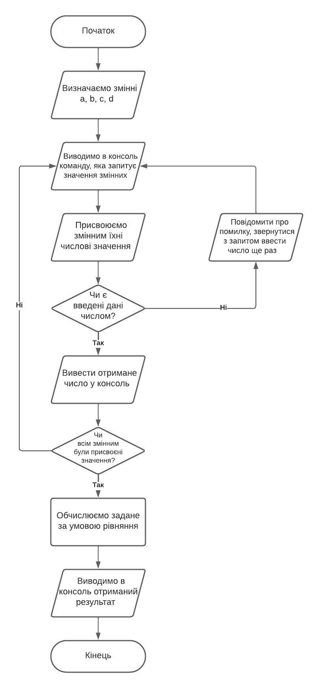
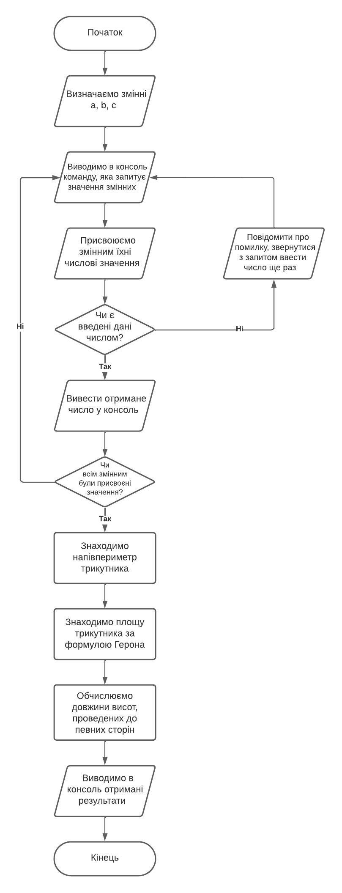
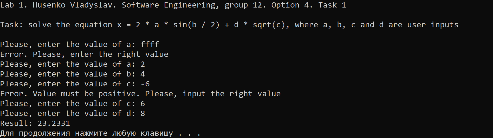
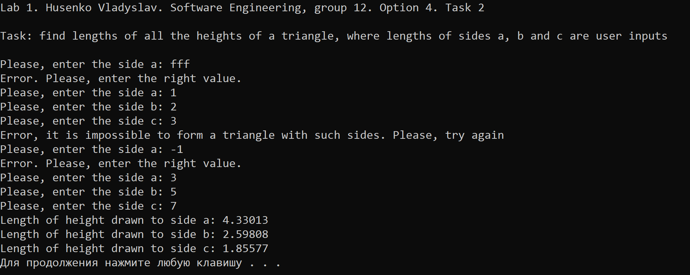
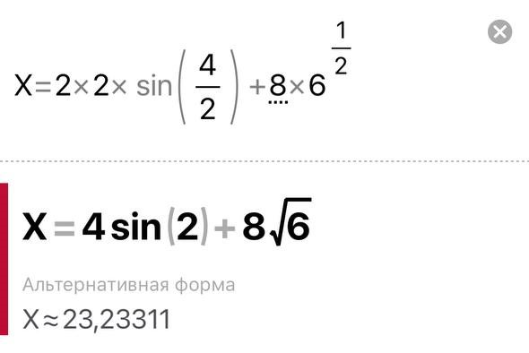
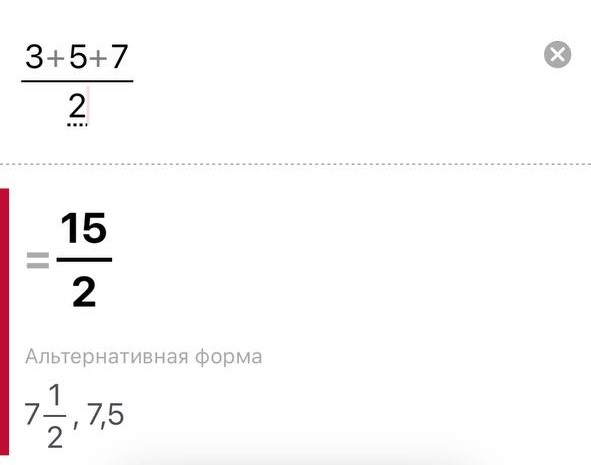
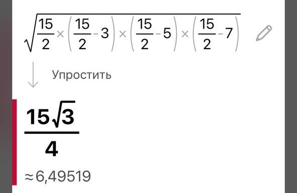
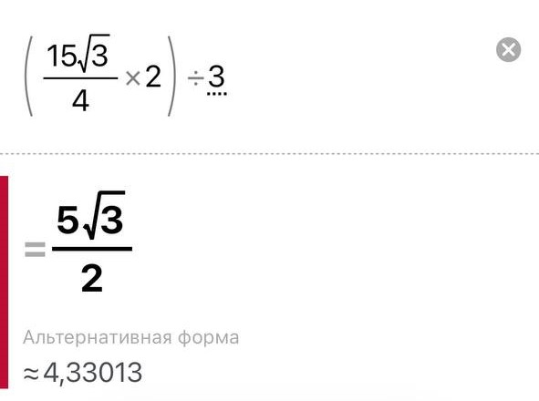
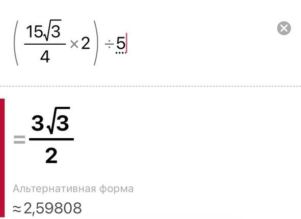

<!--
  MARKDOWN:

  **Слово** - Жирний шрифт 
  *Слово* - курсив 
  `Функції` - пишете в `Назву функції`
  
  ```cpp
    Ваш код буде тут
  ``` 
   - конструкція для вставки фото

  # Найбільший заголовок
  ## Заголовок менше
  ### Заголовок ще менше
  #### Найменший заголовок 

  Конструкція списків:
  - елемент списку
  - елемент списку
  - елемент списку

  Цей фрагмент створений лише для вашої зручності. При створенні сайту можете видалити цей фрагмент
-->
# Лабораторна робота №1

## Мета роботи

1. Вивчити особливості використання вбудованих типів даних: `char`, `int`, `long`, `short`, `float`, `double`, `unsigned char`, `unsigned int`, `unsigned long`.
2. Вивчити особливості використання функцій введення - виведення.
3. Навчитися застосовувати стандартні математичні функції.

## Умова задачі

### Завдання 1
Обчислити заданий вираз при заданих користувачем значеннях змінних A, B, C, D:
`x=2*a*sin(b/2)+d*c^(1/2)`, де  A, B, C, D - введені користувачем числа.

### Завдання 2 
Написати програму, що знаходить довжини всіх висот трикутника, де значення сторін трикутника - введені користувачем числа.

## Аналіз задачі та теоретичні обґрунтування

### Завдання 1
Для присвоєння числових значень для змінних A, B, C, D було створено функцію `rightInput` (правильне введення), яка крім отримання числових значень перевіряє чи є вони власне числами. При отриманні неправильних значень програма зазначає що відбулася помилка та просить ввести коректні значення. Після присвоєння всім змінним іхніх значень програма знаходить відповідь на рівняння за допомогою створеної функції `calculateX`, яка обчислює результат. Наостанок, результат виводиться у консоль.

#### Основні етапи:
  - Введення числових значень та присвоєння іх змінним A, B, C та D за допомогою функції `rightInput`;
  - Обчислення виразу за допомогою функції `calculateX`;
  - Виведення результату до консолі.

Для отримання результату використовуються функції `sin()` та `sqrt()` для знаходження синуса та квадратного кореня відповідно, задані у заголовному файлі стандартної бібліотеки мови програмування C++ `cmath`.

**Примітка**: для облегшення рохрахунків піднесення аргументу `c` до степеня 1/2, яке би визначалось функцією `pow( , )` замінено еквівалентною функцією `sqrt()`.

### Завдання 2
Для присвоєння числових значень для змінних A, B, C було створено функцію `rightInput` (правильне введення), яка крім отримання числових значень перевіряє чи є вони власне числами. При отриманні неправильних значень програма зазначає що відбулася помилка та просить ввести коректні значення. Після присвоєння всім змінним іхніх значень програма виконує обчислення результату згідно заданих формул та виводить його у консоль.

#### Основні етапи:
  - Введення числових значень та присвоєння іх змінним A, B, C та D за допомогою функції `rightInput`;
  - Обчислення результату за заданими формулами;
  - Виведення результату до консолі.

Для отримання результату використовується функція `sqrt()` для знаходження квадратного кореня, задана у заголовному файлі стандартної бібліотеки мови програмування C++ `cmath`.

## Алгоритм у вигляді блок-схеми

### Завдання 1 


### Завдання 2 


## Код програми

**Код** всіх файлів наведений нижче:

### Завдання 1 :
```cpp
#include <iostream>
#include <cmath>
#include <limits>

using namespace std;

// Функція для правильного введення числа з перевіркою на помилки
double rightInput(const string& prompt) {
    double value;
    while (true) {
        cout << prompt;
        if (cin >> value) {
            // Введено коректне число
            break;
        }
        else {
            // Очистка потоку введення та вивід повідомлення про помилку
            cin.clear();
            cin.ignore(numeric_limits<streamsize>::max(), '\n');
            cout << "Error. Please, input the right number" << endl;
        }
    }
    return value;
}

    // Функція для обчислення x за заданою формулою
    double calculateX(double a, double b, double c, double d) 
    {
        return 2 * a * sin(b / 2.0) + d * sqrt(c);
    }

int main()
{
    // Створюємо заголовок лабораторної роботи
    cout << "Lab 1. Husenko Vladyslav. Software Engineering, group 12. Option 4. Task 1" << endl << endl;

    double a, b, c, d;

    // Введення значень змінних з перевіркою на помилки
    a = rightInput("Input a: ");
    b = rightInput("Input b: ");
    c = rightInput("Input c: ");
    d = rightInput("Input d: ");

    // Обчислюємо x
    double x = calculateX(a, b, c, d);

    // Виводимо результат
    cout << "The result is " << x << endl;

    return 0; // Повертаємо нульовий код, щоб показати успішне виконання програми
}
```

### Завдання 2 :
```cpp
#include <iostream>
#include <cmath>
#include <limits>

using namespace std;

// Функція для правильного введення числа з перевіркою на помилки
double rightInput(const string& prompt) {
    double value;
    while (true) {
        cout << prompt;
        if (cin >> value) {
            // Введено коректне число
            break;
        }
        else {
            // Очистка потоку введення та вивід повідомлення про помилку
            cin.clear();
            cin.ignore(numeric_limits<streamsize>::max(), '\n');
            cout << "Error. Input the right value." << endl;
        }
    }
    return value;
}

int main()
{
    // Створюємо заголовок лабораторної роботи
    cout << "Lab 1. Husenko Vladyslav. Software Engineering, group 12. Option 4. Task 2" << endl << endl;

    double a, b, c;

    // Вводимо значення сторін трикутника з перевіркою на помилки
    a = rightInput("Input side a: ");
    b = rightInput("Input side b: ");
    c = rightInput("Input side c: ");

    // Обчислюємо півпериметр трикутника
    double s = (a + b + c) / 2.0;

    // Обчислюємо площу трикутника за формулою Герона
    double area = sqrt(s * (s - a) * (s - b) * (s - c));

    // Обчислюємо довжину висоти, проведеної до сторони a
    double height_a = (2.0 * area) / a;

    // Обчислюємо довжину висоти, проведеної до сторони b
    double height_b = (2.0 * area) / b;

    // Обчислюємо довжину висоти, проведеної до сторони c
    double height_c = (2.0 * area) / c;

    // Виводимо результати
    cout << "Length of height drawn to side a: " << height_a << endl;
    cout << "Length of height drawn to side b: " << height_b << endl;
    cout << "Length of height drawn to side c: " << height_c << endl;

    return 0; // Повертаємо нульовий код, щоб показати успішне виконання програми
}

```

## Результат виконання програми 

### Завдання 1



### Завдання 2 




## Аналіз достовірності результатів

### Завдання 1
За допомогою онлайн-калькулятора Photomath перевіримо достовірність обчислень програми. Використані такі значення: `a = 2`, `b = 4`, `c = 6`, `d = 8`.



Як можна засвідчитись, програма виконала правильні розрахунки.

### Завдання 2
За допомогою онлайн-калькулятора Photomath перевіримо достовірність обчислень програми. Використані такі значення: `a = 3`, `b = 5`, `c = 7`.

**Знаходження півпериметра трикутника**



**Знаходження площі трикутника**



**Знаходження довжини висоти, проведеної до сторони a**



**Знаходження довжини висоти, проведеної до сторони b**



**Знаходження довжини висоти, проведеної до сторони c**


## Висновки 

Під час виконання практичної роботи №1 я опанував такі вміння:
- Вивчив базовий синтаксис мови програмування C++.
- Вивчив особливості використання вбудованих типів даних: `char`, `int`, `long`, `short`, `float`, `double`, `unsigned char`, `unsigned int`, `unsigned long`.
- Опанував особливості використання функцій введення - виведення.
- Навчився застосовувати стандартні математичні функції.
- Навчився створювати окремі функції та використовувати їх в програмному коді.
