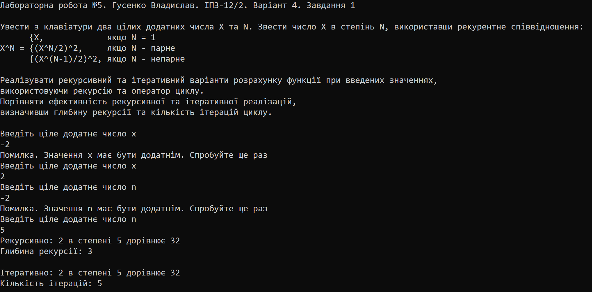
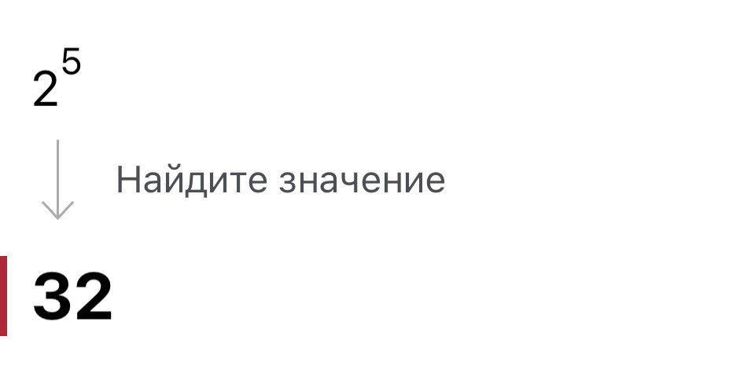
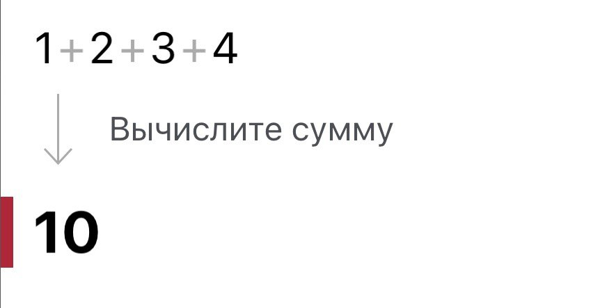

# Лабораторна робота №10

## Мета роботи

1. Вивчити поняття "структура", "масиви структур" та "об'єднання"
2. Опанувати навички роботи зі структурами
3. Навчитися розробляти масиви структур та використовувати їх.

## Умова задачі

Створити масив структур. Кожна структура складається з таких елементів: факультет, курс, група, прізвища студентів, екзаменаційні оцінки. Реалізувати запити, визначивши:
- Факультет і курс, на якому середній бал не менше 3.5;
- Прізвища студентів, що не мають трійок і двійок;
- Факультет і групу, де найбільше відмінників.
Результати запитів вивести у вигляді таблиць.

## Аналіз задачі та теоретичні обґрунтування

Для розв'язання системи ми присвоюємо змінним `X` та `N` ціле додатнє значення за допомогою команди `cin` та перевіряємо "на дурня" за допомогою циклу `while` - коли значення є меншим за 0 у консоль виводиться повідомлення про помилку та запит ввести значення ще раз. Цикл виконується до тих пір поки змінна не прийме правильне значення. <br>
Далі після отримання змінних X та N обчислюється `X^N` рекурсивно та ітеративно. Для цього було створено функції `power_r` та `power_i` для обчислення рекурсивно та ітеративно. Рекурсивний метод був визначений за допомогою команд `if - else if - else`, а ітеративний - за допомогою циклу `while`. Також, у кожній функції є змінна яка обчислює глибину рекурсії та кількість ітерацій. <br>
Отримані результати піднесення до степеня, що були визначені рекурсивно та ітеративно, а також глибина рекурсії та кількість ітерацій виводяться у консоль.

#### Основні етапи:
  - Введення цілих додатніх значеня для змінних `X` та `N`;
  - Перевірка значень змінних "на дурня";
  - Обчислення піднесення до степеня рекурсивним та ітеративним методами, визначення глибини рекурсії та кількості ітерацій;
  - Виведення результату до консолі.

## Алгоритм у вигляді блок-схеми


## Код програми

**Код** всіх файлів наведений нижче:

### Завдання 1 :
```cpp
#include <iostream>
#include <iomanip>
#include <cstring>
#include <Windows.h>

using namespace std;

const int MAX_INPUT = 50; // Максимальна кількість введених символів
const int MAX_STUDENTS = 100; // Максимальна кількість студентів

struct Student // Студент та його характеристики
{
    char faculty[MAX_INPUT]; // Факультет
    int course; // Курс - check
    int group; // Група
    char surname[MAX_INPUT]; // Прізвище
    float marks; // Оцінки
};

void introduction() // Вступна частина
{
    cout << "Лабораторна робота №10. Гусенко Владислав. ІПЗ-12. Завдання 4" << endl << endl;
    cout << "Створити масив структур. Кожна структура складається з таких елементів: факультет, курс, група, прізвища студентів, екзаменаційні оцінки" << endl;
    cout << "Реалізувати запити, визначивши:" << endl;
    cout << " - факультет і курс, на якому середній бал не менше 3.5;" << endl;
    cout << " - прізвища студентів, що не мають трійок і двійок;" << endl;
    cout << " - факультет і групу, де найбільше відмінників." << endl;
    cout << "Результати запитів вивести у вигляді таблиць" << endl << endl;
}

void createStudent(Student* array, int& students) // Створення студента
{
    if (students >= MAX_STUDENTS)
    {
        cerr << "Масив заповнений, неможливо створити нових студентів" << endl;
    }

    // Введення факультета
    cout << "Введіть назву факультета: ";
    cin.ignore();
    cin.getline(array[students].faculty, sizeof(array[students].faculty));

    // Введення курсу
    cout << "Введіть номер курсу: ";
    cin >> array[students].course;

    // Введення групи
    cout << "Введіть номер групи: ";
    cin >> array[students].group;

    // Введення прізвища
    cout << "Введіть прізвище студента: ";
    cin.ignore();
    cin.getline(array[students].surname, sizeof(array[students].surname));

    // Введення оцінок
    float totalMarks = 0; // Сума балів
    const int markNum = 5; // Нехай студент має 5 оцінок

    for (int i = 0; i < markNum; i++)
    {
        float mark;
        cout << "Введіть оцінку з " << i + 1 << " екзамена: ";
        cin >> mark;

        while (mark < 1 || mark > 5) // Перевірка на дурня
        {
            cin.clear();
            cin.ignore();
            cerr << "Помилка. Оцінка виставляється в межах від 1 до 5. Спробуйте ще раз" << endl;
            cout << "Введіть оцінку з " << i + 1 << " екзамена: ";
            cin >> mark;
        }
        totalMarks += mark; // Збільшуємо суму балів

    }
        array[students].marks = totalMarks / markNum; // Середня оцінка

        students++; // Позначаємо, що було записано усі дані студента 
}

void findThreePointFive(Student* array, int students) // Пошук факультетів і курсів, де середній бал не менше 3.5
{
    // Виводимо таблицю з результатами запиту
    cout << "----------------------------------------" << endl;
    cout << "| " << setw(15) << left << "Факультет" << "| " << setw(5) << left << "Курс" << "| " << setw(13) << left << "Середній бал" << "|" << endl;
    cout << "----------------------------------------" << endl;

    // Перевірка кожного студента
    for (int i = 0; i < students; i++)
    {
        float totalMarks = array[i].marks; // Загальний середній бал

        float average = totalMarks / 1; // Середній бал (створено задля порівняння з 3.5)

        // Виводимо дані студентів з балом 3.5+
        if (average >= 3.5)
        {
            cout << "| " << setw(15) << left << array[i].faculty << "| " << setw(5) << left << array[i].course << "| " << setw(13) << left << fixed << setprecision(2) << average << "|" << endl;
            cout << "----------------------------------------" << endl;
        }
    }
}

void findNoTwoThree(Student* array, int students) // Пошук студентів що не мають 2 та 3
{
    // Виводимо таблицю з результатами запиту
    cout << "------------------" << endl;
    cout << "| " << setw(15) << left << "Студенти" << "|" << endl;
    cout << "------------------" << endl;

    // Виводимо дані студентів, що не мають 2 та 3
    for (int i = 0; i < students; i++)
    {
        if (array[i].marks > 3)
        {
            cout << "| " << setw(15) << left << array[i].surname << "|" << endl;
            cout << "------------------" << endl;
        }
    }
}

void findSmart(Student* array, int students) // Пошук факультетів та груп з найбільшою кількістю відмінників
{
    // Виводимо таблицю з результатами запиту
    cout << "--------------------------" << endl;
    cout << "| " << setw(15) << left << "Факультет" << "| " << setw(6) << left << "Група" << "|" << endl;
    cout << "--------------------------" << endl;

    bool found = false; // Чи знайдено відмінників

    for (int i = 0; i < students; i++)
    {
        float totalMarks = array[i].marks;
        float average = totalMarks / 1;

        if (average > 4.0)
        {
            found = true;
            cout << "| " << setw(15) << left << array[i].faculty << "| " << setw(6) << left << array[i].group << "|" << endl;
            cout << "--------------------------" << endl;
        }
    }

    if (!found)
    {
        cout << "Груп з відмінниками не знайдено" << endl;
    }
}


void menu() // Меню програми
{
    int students = 0; // Кількість студентів
    Student number[MAX_STUDENTS]; // Масив структури студентів

    int choice; // Вибір
    do
    {
        cout << "Меню програми:" << endl;
        cout << "1. Додати нового студента" << endl;
        cout << "2. Показати факультети та курси, де середній бал не менше 3.5" << endl;
        cout << "3. Показати прізвища студентів, що не мають трійок і двійок" << endl;
        cout << "4. Показати факультет і групу, де найбільше відмінників" << endl;
        cout << "5. Вихід з програми" << endl << endl;
        cout << "Оберіть операцію: ";

        cin >> choice;

        switch (choice)
        {
        case 1:
            createStudent(number, students);
            break;
        case 2:
            findThreePointFive(number, students);
            break;
        case 3:
            findNoTwoThree(number, students);
            break;
        case 4:
            findSmart(number, students);
            break;
        case 5:
            break;
        default:
            cerr << "Неправильний варіант. Спробуйте ще раз.\n";
        }
    } while (choice != 5);
}

int main() // Основна частина програми
{
	SetConsoleCP(1251);
	SetConsoleOutputCP(1251);

    introduction();
    menu();

	return 0;
}
```

## Результат виконання програми 



## Аналіз достовірності результатів

### Завдання 1
За допомогою онлайн-калькулятора Photomath перевіримо достовірність обчислень програми. Використані такі значення: `X = 2`, `N = 5`.


### Завдання 2
За допомогою онлайн-калькулятора Photomath перевіримо достовірність обчислень програми. Використані такі значення: `n = 1234`.


## Висновки 

Під час виконання лабораторної роботи №5 я опанував такі вміння:
- Вивчив особливості рекурсивних процесів.
- Опанував технологію рекурсивних обчислень.
- Навчився розробляти алгоритми та програми із застосуванням рекурсивних функцій.
