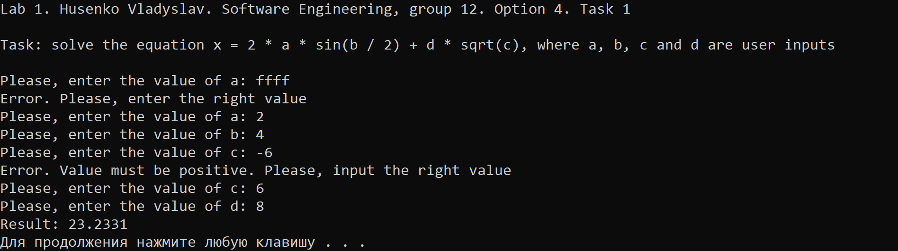
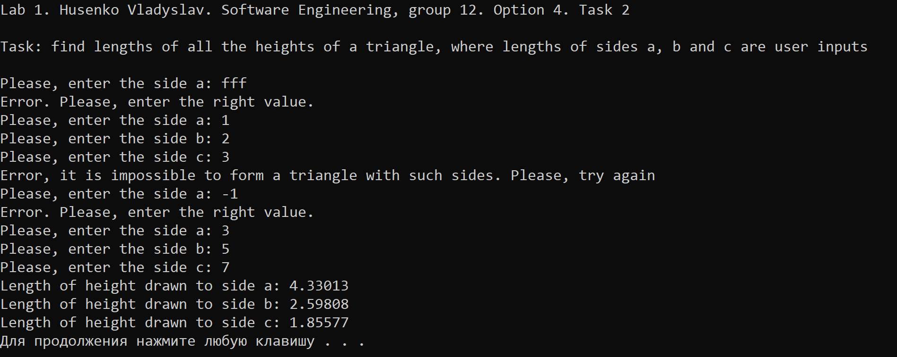
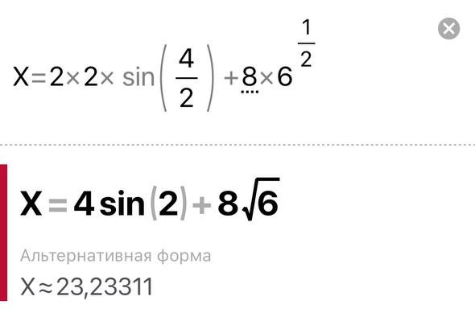
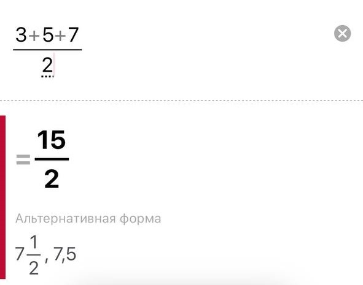
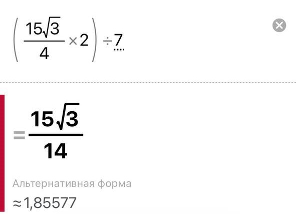

# Лабораторна робота №2

## Мета роботи

1. Вивчити особливості розгалужених обчислювальних процесів
2. Опанувати технологію використання логічних операторів

## Умова задачі

### Завдання 1
Визначити значення функції в залежності від значення її аргументу, яке вводиться з клавіатури.<br>
`       {5√x, x > 5     `<br>
`       {1/x, 1 < x < 5 `<br> 
`f(x) = {               `<br>
`       { x², -5 ≤ x ≤ 1`<br>
`       {10x, x < -5    `<br>

### Завдання 2 
Написати програму, що знаходить довжини всіх висот трикутника, де значення сторін трикутника - введені користувачем числа.

## Аналіз задачі та теоретичні обґрунтування

### Завдання 1
Для присвоєння числових значень для змінних A, B, C, D було створено функцію `getInput`, яка крім отримання числових значень перевіряє чи є вони власне числами. При отриманні неправильних значень програма зазначає що відбулася помилка та просить ввести коректні значення. У зв'язку з тим, що змінна `c` за ОДЗ повинна приймати лише позитивні значення у функції прописана опціональна перевірка на позитивність. Після присвоєння всім змінним їхніх коректних значень програма знаходить відповідь на рівняння за допомогою створеної функції `calculateX`, яка обчислює результат. Наостанок, результат виводиться у консоль.

#### Основні етапи:
  - Введення числових значень та присвоєння їх змінним A, B, C та D за допомогою функції `getInput`;
  - Перевірка змінної `c` на позитивність;
  - Обчислення виразу за допомогою функції `calculateX`;
  - Виведення результату до консолі.

Для отримання результату використовуються функції `sin()` та `sqrt()` для знаходження синуса та квадратного кореня відповідно, задані у заголовному файлі стандартної бібліотеки мови програмування C++ `cmath`. Для виведення помилок у консоль використовується команда `cerr` (character error).

**Примітка**: для облегшення розрахунків піднесення аргументу `c` до степеня 1/2, яке б визначалось функцією `pow( , )` замінено еквівалентною функцією `sqrt()`.

### Завдання 2
Для присвоєння числових значень для змінних A, B, C було створено функцію `getInput`, яка крім отримання числових значень перевіряє чи є вони власне числами та чи є вони позитивними (за логікою задачі значення сторін трикутника можуть бути лише позитивними). При отриманні неправильних значень програма зазначає що відбулася помилка та просить ввести коректні значення. При отриманні значень програма перевіряє, чи можливо побудувати трикутник за заданими сторонами та у разі неможливості виводить помилку з проханням ввести нові значення. Після присвоєння всім змінним їхніх коректних значень програма виконує обчислення результату за допомогою функцій `calculateTriangleArea` для знаходження площі трикутника та `calculateHeight` для знаходження висоти. Наостанок, результати виводиться у консоль.

#### Основні етапи:
  - Введення числових значень та присвоєння їх змінним A, B, C та D за допомогою функції `getInput`;
  - Перевірка отриманих числових даних на позитивність;
  - Перевірка на можливість побудови трикутника за заданими сторонами.
  - Обчислення результату за допомогою функцій `calculateTriangleArea` та `calculateHeight`;
  - Виведення результату до консолі.

Для отримання результату використовується функція `sqrt()` для знаходження квадратного кореня, задана у заголовному файлі стандартної бібліотеки мови програмування C++ `cmath`. Для виведення помилок у консоль використовується команда `cerr` (character error).

## Алгоритм у вигляді блок-схеми

### Завдання 1 


### Завдання 2 


## Код програми

**Код** всіх файлів наведений нижче:

### Завдання 1 :
```cpp
#include <iostream>
#include <cmath>
#include <limits>
#include <cstdlib>

using namespace std;

// Функція для коректного введення з перевіркою на помилки та опціональною перевіркою на позитивність введеного значення
double getInput(const string& prompt, bool checkPositive = false) 
{
    double value;

    while (true)
    {
        cout << prompt;
        if (cin >> value)
        {
            if (!checkPositive || (checkPositive && value > 0))
            {
                // Введене значення коректне або не потребує перевірки на позитивність
                return value;
            }
            else
            {
                // Виводимо повідомлення про помилку
                cerr << "Error. Value must be positive. Please, enter the right value" << endl;
            }
        }
        else
        {
            // Очищення потоку введення та вивід повідомлення про помилку
            cin.clear();
            cin.ignore(numeric_limits<streamsize>::max(), '\n');
            cerr << "Error. Please, input the right value" << endl;
        }
    }
}

// Створюємо функцію для обчислення x за заданою формулою
double calculateX(double a, double b, double c, double d)
{
    return 2 * a * sin(b / 2.0) + d * sqrt(c);
}

int main()
{
    // Створюємо заголовок лабораторної роботи
    cout << "Lab 1. Husenko Vladyslav. Software Engineering, group 12. Option 4. Task 1" << endl << endl;
    cout << "Task: solve the equation x = 2 * a * sin(b / 2) + d * sqrt(c), where a, b, c and d are user inputs" << endl << endl;

    double a = getInput("Please, enter the value of a: ");
    double b = getInput("Please, enter the value of b: ");
    double c = getInput("Please, enter the value of c: ", true); // Для змінної  c  виконується перевірка на позитивність, адже за ОДЗ c має бути суворо більшим за 0
    double d = getInput("Please, enter the value of d: ");

    // Обчислюємо x
    double x = calculateX(a, b, c, d);

    // Виводимо результат
    cout << "Result: " << x << endl;

    // Очікуємо натиску клавіші перед завершенням програми
    system("pause");

    return 0; // Повертаємо нульовий код, щоб показати успішне виконання програми
}
```

### Завдання 2 :
```cpp
#include <iostream>
#include <cmath>
#include <limits>
#include <cstdlib>

using namespace std;

// Функція для правильного введення позитивного значення з перевіркою на помилки та перевіркою на позитивність
double getInput(const string& prompt)
{
    double value;

    while (true)
    {
        cout << prompt;
        if (cin >> value && value > 0)
        {
            // Введене значення коректне
            return value;
        }
        else
        {
            // Очищення потоку введення та вивід повідомлення про помилку
            cin.clear();
            cin.ignore(numeric_limits<streamsize>::max(), '\n');
            cerr << "Error. Please, enter the right value." << endl;
        }
    }
}

// Створюємо функцію для обчислення площі трикутника за заданими сторонами
double calculateTriangleArea(double a, double b, double c)
{
    double p = (a + b + c) / 2.0; // формула для знаходження півпериметра трикутника
    return sqrt(p * (p - a) * (p - b) * (p - c));
}

// Створюємо функцію для знаходження висоти, проведеної до певної сторони трикутника
double calculateHeight(double area, double side)
{
    return (2.0 * area) / side;
}

int main()
{
    // Створюємо заголовок лабораторної роботи
    cout << "Lab 1. Husenko Vladyslav. Software Engineering, group 12. Option 4. Task 2" << endl << endl;
    cout << "Task: find lengths of all the heights of a triangle, where lengths of sides a, b and c are user inputs" << endl << endl;

    double a, b, c;

    do
    {
        a = getInput("Please, enter the side a: ");
        b = getInput("Please, enter the side b: ");
        c = getInput("Please, enter the side c: ");

        if (a + b <= c || a + c <= b || b + c <= a)
        {
            cerr << "Error, it is impossible to form a triangle with such sides. Please, try again" << endl;
        }
    } while (a + b <= c || a + c <= b || b + c <= a);

    // Обчислюємо значення площі трикутника
    double TriangleArea = calculateTriangleArea(a, b, c);

    // Обчислюємо значення висот
    double height_a = calculateHeight(TriangleArea, a);
    double height_b = calculateHeight(TriangleArea, b);
    double height_c = calculateHeight(TriangleArea, c);

    // Виводимо результати
    cout << "Length of height drawn to side a: " << height_a << endl;
    cout << "Length of height drawn to side b: " << height_b << endl;
    cout << "Length of height drawn to side c: " << height_c << endl;

    // Очікуємо натиску клавіші перед завершенням програми
    system("pause");

    return 0; // Повертаємо нульовий код, щоб показати успішне виконання програми
}
```

## Результат виконання програми 

### Завдання 1



### Завдання 2 




## Аналіз достовірності результатів

### Завдання 1
За допомогою онлайн-калькулятора Photomath перевіримо достовірність обчислень програми. Використані такі значення: `a = 2`, `b = 4`, `c = 6`, `d = 8`.



Як можна засвідчитись, програма виконала правильні розрахунки.

### Завдання 2
За допомогою онлайн-калькулятора Photomath перевіримо достовірність обчислень програми. Використані такі значення: `a = 3`, `b = 5`, `c = 7`.

**Знаходження півпериметра трикутника**



**Знаходження площі трикутника**


**Знаходження довжини висоти, проведеної до сторони a**


**Знаходження довжини висоти, проведеної до сторони b**


**Знаходження довжини висоти, проведеної до сторони c**



## Висновки 

Під час виконання практичної роботи №1 я опанував такі вміння:
- Вивчив базовий синтаксис мови програмування C++.
- Вивчив особливості використання вбудованих типів даних: `char`, `int`, `long`, `short`, `float`, `double`, `unsigned char`, `unsigned int`, `unsigned long`.
- Опанував особливості використання функцій введення - виведення та спеціальних функцій, таких як `cerr`.
- Навчився застосовувати стандартні математичні функції.
- Навчився створювати окремі функції та використовувати їх в програмному коді.

