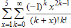
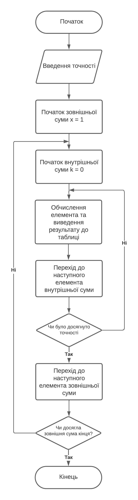
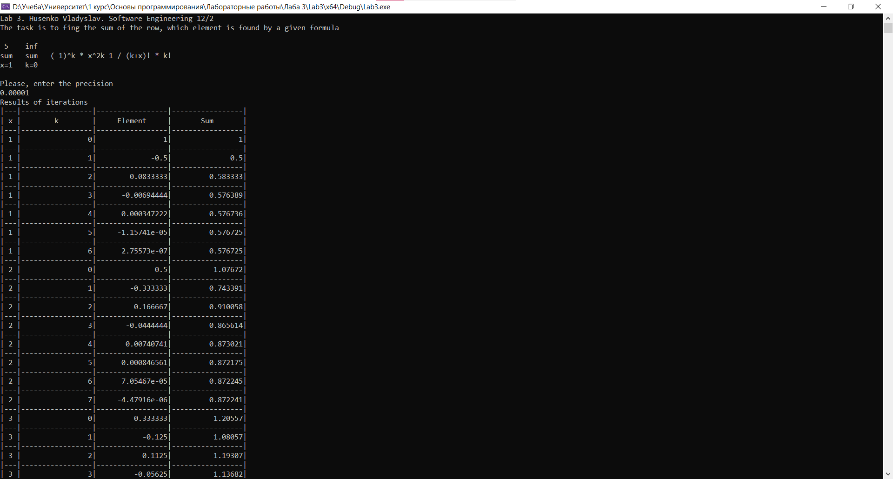

# Лабораторна робота №3

## Мета роботи

1. Вивчити особливості циклічних обчислювальних процесів
2. Опанувати технологію використання операторів циклів
3. Навчитися розробляти алгоритми та програми циклічних процесів

## Умова задачі

Обчислити суму ряду, елемент котрого розраховується за формулою:



## Аналіз задачі та теоретичні обґрунтування

Програма містить в собі подвійну суму, результати обчислення якої заносяться до таблиці. Для розрахунку першої суми з параметром від 1 до 5 використовується цикл `for`. Для розрахунку внутрішньої суми з параметром від 0 до нескінченності використовується цикл `while` або `do-while`. Для визначення нескінченності потрібно задати точність розрахунку значення поточного элементу ряду. Підсумовування припиняється, якщо досягнута задана користувачем точність розрахунку. Кількість доданків внутрішньої суми для кожного параметра зовнішньої суми має бути різною. Розрахунок факторіалу та степені числа виконується, використовуючи рекурентні співвідношення. Для запобігання переповнення (overflow ) комірки RAM здійснюється вихід із внутрішнього циклу при досягненні значення поточного элементу ряду 10^-38 або 10^+38. Результат подається  у вигляді таблиці із чотирма колонками, що визначають параметри зовнішньої та внутрішньої сум, значення члена ряду та накопичувану суму.

#### Основні етапи:

  - Отримання від користувача точності обчислення
  - Обчислення суми рядку, визначеного подвійною сумою
  - Виведення результатів до таблиці

## Алгоритм у вигляді блок-схеми



## Код програми

```cpp
#include <iostream>
#include <iomanip>
#include <cfloat>

using namespace std;

int x; // Визначник зовнішньої суми
int k; // Визначник внутрішньої суми
float sum = 0; // Сума
float precision = 0; // Точність розрахунків
float num; // Чисельник
float den; // Знаменник
float factk; //
float factkx; //
float element; // Елемент ряду

int factorial(int num) // Формула для рекурентного обчислення факторіала
{
	int fact = 1;
	// Цикл для визначення факторіалу
	for (int a = 1; a <= num; a++) {
		fact = fact * a;
	}
	return fact; // Повернення факторіала
}

void introduction() // Вступна частина
{
	cout << "Lab 3. Husenko Vladyslav. Software Engineering 12/2" << endl;
	cout << "The task is to fing the sum of the row, which element is found by a given formula" << endl << endl;
	cout << " 5    inf" << endl;
	cout << "sum   sum   (-1)^k * x^2k-1 / (k+x)! * k!" << endl;
	cout << "x=1   k=0" << endl << endl;
}

void output() // Вивід даних у виді таблиці
{
	cout << "| " << x << " |" << setw(17) << k << "|" << setw(17) << element << "|" << setw(17) << sum << "|" << endl;
	cout << "|---|-----------------|-----------------|-----------------|" << endl;
}

void calculate()
{
	float negOnePow; // -1 у степені k
	float xPow; // x у степені 2k-1

	for (x = 1; x <= 5; x++)
	{
		k = 0; // Початкове значення k
		negOnePow = 1; // (-1)^k при k = 0 буде 1
		xPow = 1.0 / x; // x^2k-1 k = 0 буде 1/x
		element = xPow;
		sum += element; // Накопичення суми
		output(); // Вивід значення
		
		do
		{
			k++; 
			negOnePow *= -1.0;
			xPow *= x * x;	

			num = negOnePow * xPow; // Визначення чисельника
			den = factorial(k + x) * factorial(k); // Визначення знаменника
			element = num / den; 
			
			if (fabs(element) < FLT_MIN || fabs(element) > FLT_MAX) // Виконати вихід із програми при перевищенні лімітних значень
			{
				cout << "Overflow! Breaking cycle with k..." << endl;
				break;
			}

			sum += element;
			output();

		} while (fabs(element) > precision);
	}
}

int main()
{
	introduction();
	bool answer = 0;
	do
	{
		cout << "Please, enter the precision" << endl;
		cin >> precision;
		cout << "Results of iterations" << endl;
		cout << "|---|-----------------|-----------------|-----------------|" << endl;
		cout << "| x |        k        |     Element     |       Sum       |" << endl;
		cout << "|---|-----------------|-----------------|-----------------|" << endl;
		calculate();
		sum = 0;
		precision = 0;
		cout << "Would you like to continue? 1 - yes, 0 - no" << endl;
		cin >> answer;
	} while (answer != 0);
}
```

## Результат виконання програми 



## Аналіз достовірності результатів

Для перевірки достовірності результатів використаємо онлайн-калькулятор Photomath:

Як можна засвідчитися, програма видає коректні результати.

## Висновки 

Під час виконання лабораторної роботи №10 я опанував такі вміння:
- Вивчив особливості циклічних обчислювальних процесів
- Опанував технологію використання операторів циклів
- Навчився розробляти алгоритми та програми циклічних процесів
