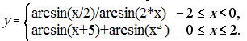
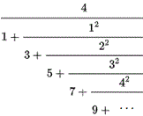
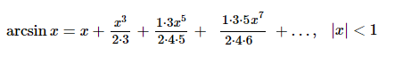
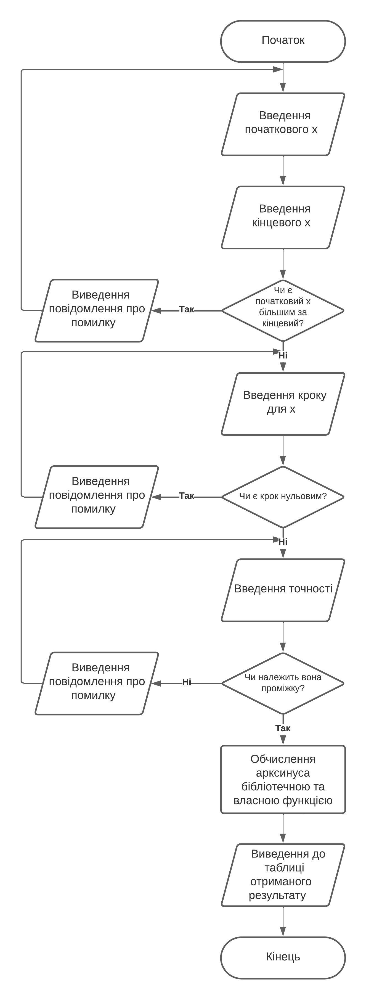
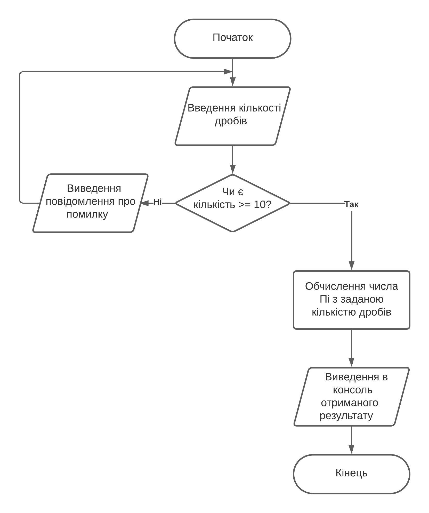
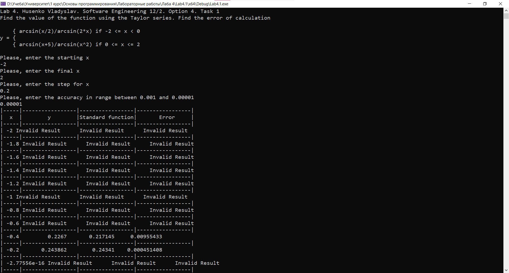
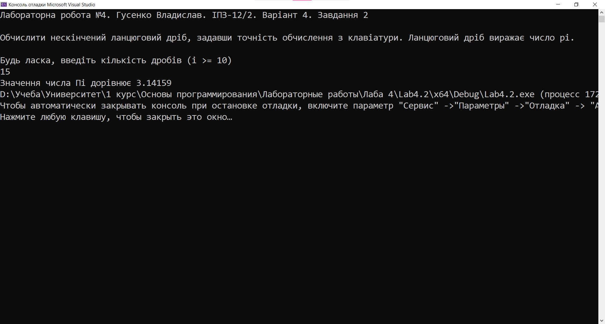
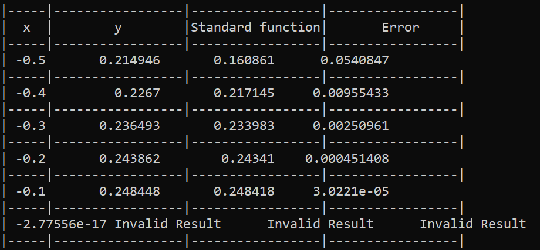
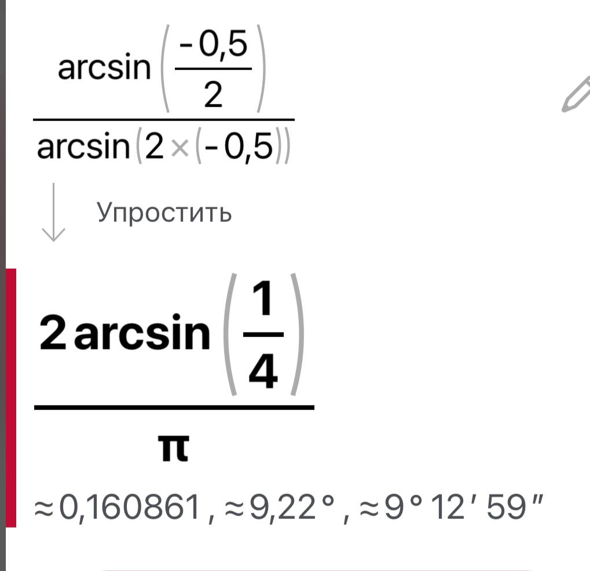
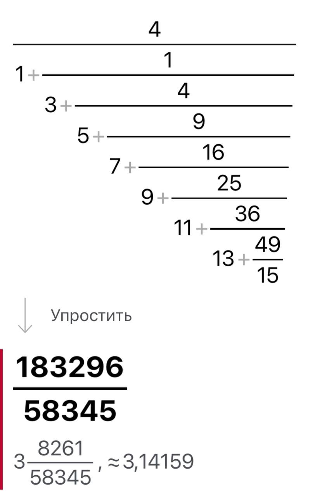

# Лабораторна робота №4

## Мета роботи

1. Вивчити особливості циклічних обчислювальних процесів з розгалуженнями
2. Опанувати технологію рекурентних обчислень
3. Навчитися розробляти алгоритми та програми розвинення функцій у ряди

## Умова задачі

### Завдання 1
Обчислити значення функції `у`, розвинувши функцію `asin(x)` у ряд Тейлора. Визначити похибку.



### Завдання 2 
Обчислити нескінчений ланцюговий дріб, задавши точність обчислення з клавіатури. Ланцюговий дріб виражає число `рі`.



## Аналіз задачі та теоретичні обґрунтування

### Завдання 1
Програма виконує обчислення арксинуса за допомогою функції `asin()` з бібліотеки `cmath` та за допомогою власноруч створеної функції `arcsin()`. За умовою задачі, функцію `asin(x)` ми повинні розвинути у ряд Тейлора. Для цього скористуємося формулою:



Рекурентне співвідношення виконується допоки результат більший за точність вимірювання. У завданні задаються дві умови, які потрібно виконати. Користувач вводить початкове та кінцеві значення `х`, точність та крок. У консоль виводиться таблиця з результатами обчислень - для бібліотечної функції, для самостійної та похибкою обчислення. 

#### Основні етапи:
  - Введення початкових й кінцевих значень, точності та кроку для `x`;
  - Перевірка значень змінних "на дурня";
  - Обчислення виразу за допомогою бібліотечної, створеної функцій та визначення похибки;
  - Виведення результату у таблицю.

### Завдання 2
Програма виконує обчислення нескінченного ланцюгового дробу для знаходження числа Пі. Хоча у завданні вказано отримати  точність обчислення, мною було вирішено використати **кількість дробів**, так як це облегшує написання коду та є більш ефективним. Тому від користувача програма отримує кількість знаменників у нескінченному дробі та знаходить результат, що згодом виводиться у консоль.

#### Основні етапи:
  - Введення кількості дробів (i >= 10);
  - Перевірка значення змінної "на дурня";
  - Обчислення значення числа Пі;
  - Виведення результату до консолі.

## Алгоритм у вигляді блок-схеми

### Завдання 1 



### Завдання 2



## Код програми

**Код** всіх файлів наведений нижче:

### Завдання 1 :
```cpp
#include <iostream>
#include <cmath>
#include <iomanip>

using namespace std;

double y, // Значення виразу за формулою Тейлора
sf, // Значення стандартної функції
x, // Аргумент функції
xs, // Початкове значення аргументу
xf, // Кінцеве значення аргументу
xstep, // Крок зміни аргументу
error, // Похибка
accuracy; // Точність обчислення
bool flag; // Можливість обчислення функції

double arcsin(double x)
{
    double result = 0;
    double element = x;
    double numerator = x;
    double denominator = 1.0;
    int i = 1;

    while (fabs(element) > accuracy)
    {
        result += element;
        numerator *= x * x;
        denominator *= (2 * i) * (2 * i + 1);
        element = numerator / denominator;
        i++;
    }
    return result;
}

void introduction() //Заголовок лабораторної роботи
{
    cout << "Lab 4. Husenko Vladyslav. Software Engineering 12/2. Option 4. Task 1" << endl;
    cout << "Find the value of the function using the Taylor series. Find the error of calculation" << endl << endl;
    cout << "    { arcsin(x/2)/arcsin(2*x) if -2 <= x < 0" << endl;
    cout << "y = {" << endl;
    cout << "    { arcsin(x+5)/arcsin(x^2) if 0 <= x <= 2" << endl << endl;
}

int main()
{
    introduction();

    cout << "Please, enter the starting x" << endl;
    cin >> xs;
    cout << "Please, enter the final x" << endl;
    cin >> xf;

    while (xs > xf)
    {
        cout << "Error. Starting x cannot be higher than the final one, try again" << endl;
        cout << "Please, enter the starting x" << endl;
        cin >> xs;
        cout << "Please, enter the final x" << endl;
        cin >> xf;
    }

    cout << "Please, enter the step for x" << endl;
    cin >> xstep;

    while (xstep == 0)
    {
        cerr << "Error. Step cannot be zero. Please, try again" << endl;
        cin >> xstep;
    }

    cout << "Please, enter the accuracy in range between 0.001 and 0.00001" << endl;
    cin >> accuracy;

    while (accuracy > 0.001 || accuracy < 0.00001)
    {
        cerr << "Error. Please, enter the accuracy in range between 0.001 and 0.00001" << endl;
        cin >> accuracy;
    }

    cout << "|-----|-----------------|-----------------|-----------------|" << endl;
    cout << "|  x  |        y        |Standard function|       Error     |" << endl;
    cout << "|-----|-----------------|-----------------|-----------------|" << endl;

    for (x = xs; x <= xf; x += xstep) {
        flag = true;
        if (-2 <= x && x < 0) {
            y = arcsin(x / 2) / arcsin(2 * x);
            sf = asin(x / 2) / asin(2 * x);
            error = fabs(sf - y);
        }
        else if (0 <= x && x <= 2) {
            y = arcsin(x + 5) / arcsin(x * x);
            sf = asin(x + 5) / asin(x * x);
            error = fabs(sf - y);
        }
        else {
            flag = false;
        }

        if (flag) {
            if (isnan(y) || isinf(y) || isnan(sf) || isinf(sf)) {
                cout << "| " << x << " Invalid Result      Invalid Result      Invalid Result      " << endl;
                cout << "|-----|-----------------|-----------------|-----------------|" << endl;
            }
            else {
                cout << "| " << setw(2) << x << setw(15) << y << setw(15) << sf << setw(15) << error << endl;
                cout << "|-----|-----------------|-----------------|-----------------|" << endl;
            }
        }
        else {
            cout << "| " << setw(2) << x << setw(15) << "Function not defined" << endl;
            cout << "|-----|-----------------------------------------------------|" << endl;
        }
    }

    system("pause");

    return 0;
}
```

### Завдання 2 :
```cpp
#include <iostream>
#include <iomanip>
#include <cmath>
#include <Windows.h>

using namespace std;

int i; // Кількість дробів
double result; // Результат
double element; // Елемент дробу

void introduction()
{
	cout << "Лабораторна робота №4. Гусенко Владислав. ІПЗ-12/2. Варіант 4. Завдання 2" << endl << endl;
	cout << "Обчислити нескінчений ланцюговий дріб, задавши точність обчислення з клавіатури. Ланцюговий дріб виражає число рі." << endl << endl;
}

double calculatePi(int i)
{
	do
	{
		cout << "Будь ласка, введіть кількість дробів (i >= 10)" << endl;
		cin >> i;
	} while (i < 10);

	double element = 2 * i + 1;
	while (i >= 0)
	{
		if (i == 0)
		{
			element = 4 / element;
		}
		else
		{
			element = (2 * i - 1) + (i * i) / element;
		}
		i--;
	}
	return element;
}

int main()
{
	SetConsoleCP(1251);
	SetConsoleOutputCP(1251);

	introduction();

	cout << "Значення числа Пі дорівнює " << calculatePi(i);

  return 0;
}
```

## Результат виконання програми 

### Завдання 1



### Завдання 2 



## Аналіз достовірності результатів

### Завдання 1
У зв'язку зі специфічністю заданої умови та самої формули арксинуса, програма видає значення у проміжку від -0.5 до 0 - всі інші значення або дорівнюють нескінченності, або не є числом. Перевіримо достовірність на таких значеннях - `xs = -0.5`, `xf = 0`, `xstep = 0.1`:



За допомогою онлайн-калькулятора Photomath перевіримо достовірність обчислень програми.



Як можна засвідчитися, програма видає коректні результати, а похибка із новоствореною функцією є мінімільною - `0.054`, а з наближенням до 0 стає ще меншою.

### Завдання 2
За допомогою онлайн-калькулятора Photomath перевіримо достовірність обчислень програми. Використані такі значення: `i = 10`.



Як можна засвідчитися, програма видає коректні результати.

## Висновки 

Під час виконання лабораторної роботи №4 я опанував такі вміння:
- Вивчив особливості циклічних обчислювальних процесів з розгалуженнями
- Опанував технологію рекурентних обчислень
- Навчився розробляти алгоритми та програми розвинення функцій у ряди
