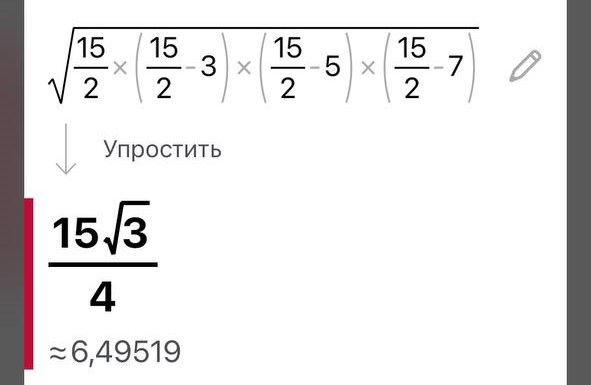

# Лабораторна робота №5

## Мета роботи

1. Вивчити особливості рекурсивних процесів.
2. Опанувати технологію рекурсивних обчислень.
3. Навчитися розробляти алгоритми та програми із застосуванням рекурсивних функцій.

## Умова задачі

### Завдання 1
Увести з клавіатури два цілих додатних числа X та N. Звести число X в степінь N, використавши рекурентне співвідношення: <br>
`      {X, якщо N = 1  `<br> 
`X^N = {(X^N/2)^2, якщо N - парне`<br>
`      {(X^(N-1)/2)^2, якщо N - непарне`<br>
Реалізувати рекурсивний та ітеративний варіанти розрахунку функції при введених значеннях, використовуючи рекурсію та оператор циклу. Порівняти ефективність рекурсивної та ітеративної реалізацій, визначивши глибину рекурсії та кількість ітерацій циклу.

### Завдання 2 
Увести з клавіатури натуральне число n. Обчисліть суму його цифр. При розв'язанні цього завдання не можна використовувати цикли, рядки, списки, масиви.

## Аналіз задачі та теоретичні обґрунтування

### Завдання 1
Для присвоєння числових значень для змінних A, B, C, D було створено функцію `getInput`, яка крім отримання числових значень перевіряє чи є вони власне числами. При отриманні неправильних значень програма зазначає що відбулася помилка та просить ввести коректні значення. У зв'язку з тим, що змінна `c` за ОДЗ повинна приймати лише позитивні значення у функції прописана опціональна перевірка на позитивність. Після присвоєння всім змінним їхніх коректних значень програма знаходить відповідь на рівняння за допомогою створеної функції `calculateX`, яка обчислює результат. Наостанок, результат виводиться у консоль.

#### Основні етапи:
  - Введення числових значень та присвоєння їх змінним A, B, C та D за допомогою функції `getInput`;
  - Перевірка змінної `c` на позитивність;
  - Обчислення виразу за допомогою функції `calculateX`;
  - Виведення результату до консолі.

Для отримання результату використовуються функції `sin()` та `sqrt()` для знаходження синуса та квадратного кореня відповідно, задані у заголовному файлі стандартної бібліотеки мови програмування C++ `cmath`. Для виведення помилок у консоль використовується команда `cerr` (character error).

**Примітка**: для облегшення розрахунків піднесення аргументу `c` до степеня 1/2, яке б визначалось функцією `pow( , )` замінено еквівалентною функцією `sqrt()`.

### Завдання 2
Для присвоєння числових значень для змінних A, B, C було створено функцію `getInput`, яка крім отримання числових значень перевіряє чи є вони власне числами та чи є вони позитивними (за логікою задачі значення сторін трикутника можуть бути лише позитивними). При отриманні неправильних значень програма зазначає що відбулася помилка та просить ввести коректні значення. При отриманні значень програма перевіряє, чи можливо побудувати трикутник за заданими сторонами та у разі неможливості виводить помилку з проханням ввести нові значення. Після присвоєння всім змінним їхніх коректних значень програма виконує обчислення результату за допомогою функцій `calculateTriangleArea` для знаходження площі трикутника та `calculateHeight` для знаходження висоти. Наостанок, результати виводиться у консоль.

#### Основні етапи:
  - Введення числових значень та присвоєння їх змінним A, B, C та D за допомогою функції `getInput`;
  - Перевірка отриманих числових даних на позитивність;
  - Перевірка на можливість побудови трикутника за заданими сторонами.
  - Обчислення результату за допомогою функцій `calculateTriangleArea` та `calculateHeight`;
  - Виведення результату до консолі.

Для отримання результату використовується функція `sqrt()` для знаходження квадратного кореня, задана у заголовному файлі стандартної бібліотеки мови програмування C++ `cmath`. Для виведення помилок у консоль використовується команда `cerr` (character error).

## Алгоритм у вигляді блок-схеми

### Завдання 1 


### Завдання 2 


## Код програми

**Код** всіх файлів наведений нижче:

### Завдання 1 :
```cpp
#include <iostream>
#include <cmath>
#include <Windows.h>

using namespace std;

int x, n; // Змінні x та n
int r_depth, i_count = 0; // Змінні для глибини рекурсії та кількості ітерацій

void introduction() // Вступна частина
{
    cout << "Лабораторна робота №5. Гусенко Владислав. ІПЗ-12/2. Варіант 4. Завдання 1" << endl << endl;
    cout << "Увести з клавіатури два цілих додатних числа X та N. Звести число X в степінь N, використавши рекурентне співвідношення:" << endl << endl;
    cout << "      {X,             якщо N = 1" << endl;
    cout << "X^N = {(X^N/2)^2,     якщо N - парне" << endl;
    cout << "      {(X^(N-1)/2)^2, якщо N - непарне" << endl << endl;
    cout << "Реалізувати рекурсивний та ітеративний варіанти розрахунку функції при введених значеннях, \nвикористовуючи рекурсію та оператор циклу." << endl;
    cout << "Порівняти ефективність рекурсивної та ітеративної реалізацій, \nвизначивши глибину рекурсії та кількість ітерацій циклу." << endl << endl;
}

int power_r(int x, int n) // Функція для рекурентного обчислення степеня
{
    r_depth++;
    if (n == 0)
    {
        return 1;
    }
    else if (n == 1)
    {
        return x;
    }
    else if (n % 2 == 0)
    {
        int res_r = power_r(x, n / 2);
        return res_r * res_r;
    }
    else
    {
        int res = power_r(x, (n - 1) / 2);
        return res * res * x;
    }
}

int power_i(int x, int n) // Функція для ітеративного обчислення степеня
{
    int res_i = 1;
    while (n > 0)
    {
        if (n % 2 == 1)
        {
            res_i *= x;
            i_count++;
        }
        x *= x;
        n /= 2;
        i_count++;
    }
    return res_i;
}

int main()
{
    SetConsoleCP(1251);
    SetConsoleOutputCP(1251);

    introduction();

    cout << "Введіть ціле додатнє число x" << endl;
    cin >> x;

    while (x < 0) // Перевірка на дурня
    {
        cerr << "Помилка. Значення x має бути додатнім. Спробуйте ще раз" << endl;
        cout << "Введіть ціле додатнє число x" << endl;
        cin >> x;
    }

    cout << "Введіть ціле додатнє число n" << endl;
    cin >> n;

    while (n < 0) // Перевірка на дурня
    {
        cerr << "Помилка. Значення n має бути додатнім. Спробуйте ще раз" << endl;
        cout << "Введіть ціле додатнє число n" << endl;
        cin >> n;
    }

    int final_r = power_r(x, n); // Визначення фінального рекурсивного результату
    cout << "Рекурсивно: " << x << " в степені " << n << " дорівнює " << final_r << endl;
    cout << "Глибина рекурсії: " << r_depth << endl << endl;

    int final_i = power_i(x, n); // Визначення фінального ітеративного результату
    cout << "Ітеративно: " << x << " в степені " << n << " дорівнює " << final_i << endl;
    cout << "Кількість ітерацій: " << i_count << endl << endl;

    system("pause");
    return 0;
}
```

### Завдання 2 :
```cpp
#include <iostream>
#include <Windows.h>

using namespace std;

void introduction() // Вступна частина
{
    cout << "Лабораторна робота №5. Гусенко Владислав. ІПЗ-12/2. Варіант 4. Завдання 2" << endl << endl;
    cout << "Увести з клавіатури натуральне число n. Обчисліть суму його цифр. " << endl;
    cout << "При розв'язанні цього завдання не можна використовувати цикли, рядки, списки, масиви." << endl;
    cout << "Контрольний тест: введено 179, отриманий результат: 17." << endl << endl;
}

int sumOfDigits(int n) // Функція для обчислення суми цифр у числі
{
    if (n < 10) {
        return n;
    }
    else {
        return n % 10 + sumOfDigits(n / 10);
    }
}

int main() // Основна частина
{
    SetConsoleCP(1251);
    SetConsoleOutputCP(1251); // Підключення кирилиці

    introduction();

    int n;
    cout << "Введіть натуральне число n: ";
    cin >> n;

    while (n <= 0) //Перевірка на дурня
    {
        cout << "Введене число не є натуральним." << endl;
        cout << "Введіть натуральне число n: ";
        cin >> n;
    }

    int result = sumOfDigits(n);
    cout << "Сума цифр числа " << n << " дорівнює " << result << endl; // Виведення результату

    system("pause");
    return 0;
}
```

## Результат виконання програми 

### Завдання 1


### Завдання 2 


## Аналіз достовірності результатів

### Завдання 1
За допомогою онлайн-калькулятора Photomath перевіримо достовірність обчислень програми. Використані такі значення: `a = 2`, `b = 4`, `c = 6`, `d = 8`.


Як можна засвідчитись, програма виконала правильні розрахунки.

### Завдання 2
За допомогою онлайн-калькулятора Photomath перевіримо достовірність обчислень програми. Використані такі значення: `a = 3`, `b = 5`, `c = 7`.

**Знаходження півпериметра трикутника**


**Знаходження площі трикутника**



**Знаходження довжини висоти, проведеної до сторони a**


**Знаходження довжини висоти, проведеної до сторони b**


**Знаходження довжини висоти, проведеної до сторони c**


## Висновки 

Під час виконання практичної роботи №1 я опанував такі вміння:
- Вивчив базовий синтаксис мови програмування C++.
- Вивчив особливості використання вбудованих типів даних: `char`, `int`, `long`, `short`, `float`, `double`, `unsigned char`, `unsigned int`, `unsigned long`.
- Опанував особливості використання функцій введення - виведення та спеціальних функцій, таких як `cerr`.
- Навчився застосовувати стандартні математичні функції.
- Навчився створювати окремі функції та використовувати їх в програмному коді.

