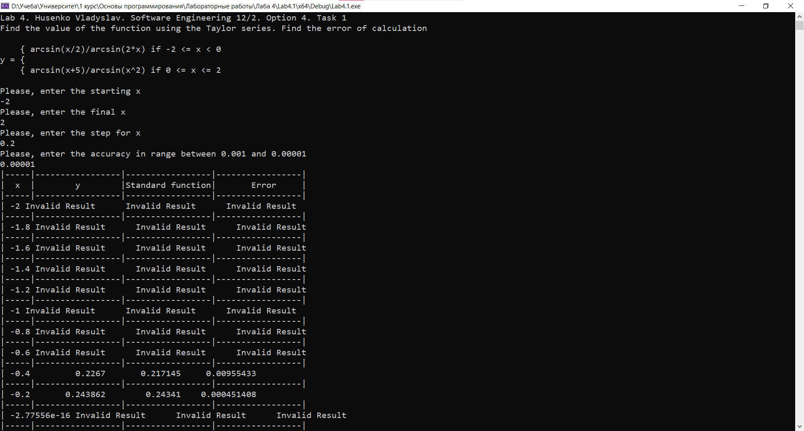
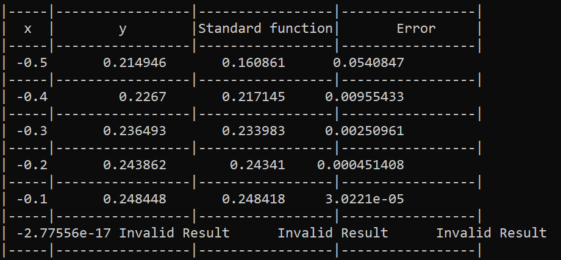

# Лабораторна робота №6

## Мета роботи

1. Ознайомитися з особливостями типу масиву;
2. Опанувати технологію застосування масивів даних;
3. Навчитися розробляти алгоритми та програми із застосуванням одновимірних масивів

## Умова задачі

### Завдання 1

Створити два числових масиви, кількість елементів яких ввести з клавіатури. Передбачити меню вибору способу створення масиву: введення з клавіатури або генерація псевдовипадкових чисел. Знайти найменший серед тих елементів першого масиву, які співпадають із значеннями елементів другого масиву. Вивести на екран масиви, найменший елемент та його індекс.

### Завдання 2 

Створити одновимірний масив, кількість елементів якого ввести з клавіатури. Передбачити меню вибору способу створення масиву: введення з клавіатури або генерація псевдовипадкових чисел. Відсортувати масив за алгоритмом швидкого cортування (Quick Sort) та здійснити пошук в масиві за алгоритмом рекурсивного бінарного пошуку. Передбачити виведення проміжних результатів в процесі виконання ітерацій сортування масиву.

## Аналіз задачі та теоретичні обґрунтування

### Завдання 1
Програма створює два масиви даних, розмірність яких вводиться з клавіатури. Користувач має вибір - згенерувати значення в масиві чи ввести їх власноруч. У консоль виводяться масиви, а після цього у консоль виводиться найменше співпадіння в обох масивах та його індекс у першому масиві.

#### Основні етапи:
  - Введення розмірності масивів;
  - Вибір методу генерації елементів в масивах;
  - Виведення масивів у консоль
  - Визначення найменшого спільного елемента та його індекса у першому масиві;

### Завдання 2
Програма створює масив даних, розмірність якого вводиться з клавіатури. Користувач має вибір - згенерувати значення в масиві чи ввести їх власноруч. За допомогою алгоритма Quick Sort здійснюється сортування від найменшого до найбільшого елемента. Наостанок, користувач має можливість здійснити пошук елемента за допомогою бінарного пошуку - при знайденні елемента у консоль виводиться індекс цього елемента. Користувач може виконувати пошук до тих пір, поки сам цього хоче.

#### Основні етапи:
  - Введення розмірності масиву
  - Вибір методу генерації елементів в масиві;
  - Сортування масиву за допомогою алгоритма Quick Sort
  - Пошук елемента у масиві за допомогою бінарного пошуку;

## Алгоритм у вигляді блок-схеми

### Завдання 1 


### Завдання 2


## Код програми

**Код** всіх файлів наведений нижче:

### Завдання 1 :
```cpp
#include <iostream>
#include <cmath>
#include <iomanip>

using namespace std;

double y, // Значення виразу за формулою Тейлора
sf, // Значення стандартної функції
x, // Аргумент функції
xs, // Початкове значення аргументу
xf, // Кінцеве значення аргументу
xstep, // Крок зміни аргументу
error, // Похибка
accuracy; // Точність обчислення
bool flag; // Можливість обчислення функції

double arcsin(double x)
{
    double result = 0;
    double element = x;
    double numerator = x;
    double denominator = 1.0;
    int i = 1;

    while (fabs(element) > accuracy)
    {
        result += element;
        numerator *= x * x;
        denominator *= (2 * i) * (2 * i + 1);
        element = numerator / denominator;
        i++;
    }
    return result;
}

void introduction() //Заголовок лабораторної роботи
{
    cout << "Lab 4. Husenko Vladyslav. Software Engineering 12/2. Option 4. Task 1" << endl;
    cout << "Find the value of the function using the Taylor series. Find the error of calculation" << endl << endl;
    cout << "    { arcsin(x/2)/arcsin(2*x) if -2 <= x < 0" << endl;
    cout << "y = {" << endl;
    cout << "    { arcsin(x+5)/arcsin(x^2) if 0 <= x <= 2" << endl << endl;
}

int main()
{
    introduction();

    cout << "Please, enter the starting x" << endl;
    cin >> xs;
    cout << "Please, enter the final x" << endl;
    cin >> xf;

    while (xs > xf)
    {
        cout << "Error. Starting x cannot be higher than the final one, try again" << endl;
        cout << "Please, enter the starting x" << endl;
        cin >> xs;
        cout << "Please, enter the final x" << endl;
        cin >> xf;
    }

    cout << "Please, enter the step for x" << endl;
    cin >> xstep;

    while (xstep == 0)
    {
        cerr << "Error. Step cannot be zero. Please, try again" << endl;
        cin >> xstep;
    }

    cout << "Please, enter the accuracy in range between 0.001 and 0.00001" << endl;
    cin >> accuracy;

    while (accuracy > 0.001 || accuracy < 0.00001)
    {
        cerr << "Error. Please, enter the accuracy in range between 0.001 and 0.00001" << endl;
        cin >> accuracy;
    }

    cout << "|-----|-----------------|-----------------|-----------------|" << endl;
    cout << "|  x  |        y        |Standard function|       Error     |" << endl;
    cout << "|-----|-----------------|-----------------|-----------------|" << endl;

    for (x = xs; x <= xf; x += xstep) {
        flag = true;
        if (-2 <= x && x < 0) {
            y = arcsin(x / 2) / arcsin(2 * x);
            sf = asin(x / 2) / asin(2 * x);
            error = fabs(sf - y);
        }
        else if (0 <= x && x <= 2) {
            y = arcsin(x + 5) / arcsin(x * x);
            sf = asin(x + 5) / asin(x * x);
            error = fabs(sf - y);
        }
        else {
            flag = false;
        }

        if (flag) {
            if (isnan(y) || isinf(y) || isnan(sf) || isinf(sf)) {
                cout << "| " << x << " Invalid Result      Invalid Result      Invalid Result      " << endl;
                cout << "|-----|-----------------|-----------------|-----------------|" << endl;
            }
            else {
                cout << "| " << setw(2) << x << setw(15) << y << setw(15) << sf << setw(15) << error << endl;
                cout << "|-----|-----------------|-----------------|-----------------|" << endl;
            }
        }
        else {
            cout << "| " << setw(2) << x << setw(15) << "Function not defined" << endl;
            cout << "|-----|-----------------------------------------------------|" << endl;
        }
    }

    system("pause");

    return 0;
}
```

### Завдання 2 :
```cpp
#include <iostream>
#include <cstdlib>
#include <ctime>
#include <Windows.h>

using namespace std;

int vybir;

const int MAX_SIZE = 100; // Максимальний розмір масиву

void introduction()
{
    cout << "Лабораторна робота №6. Гусенко Владислав. ІПЗ-12/2. Завдання 4.2" << endl << endl;
    cout << "Створити одновимірний масив, кількість елементів якого ввести з клавіатури." << endl;
    cout << "Передбачити меню вибору способу створення масиву: введення з клавіатури або генерація псевдовипадкових чисел." << endl;
    cout << "Відсортувати масив за алгоритмом швидкого cортування (Quick Sort) та здійснити пошук в масиві за алгоритмом рекурсивного бінарного пошуку." << endl;
    cout << "Передбачити виведення проміжних результатів в процесі виконання ітерацій сортування масиву." << endl << endl;
}

void fillArray(int arr[], int size, bool generateRandom)  // Створення масиву
{
    if (generateRandom) {
        srand((unsigned)(time(NULL))); // Генератор випадкових чисел
        for (int i = 0; i < size; ++i)
        {
            arr[i] = rand() % 10; // Випадкові числа
        }
    }
    else
    {
        cout << "Введіть " << size << " чисел: ";
        for (int i = 0; i < size; ++i)
        {
            cin >> arr[i]; // Числа, введені з клавіатури
        }
    }
}

void printArray(int arr[], int size) // Виведення масиву
{
    for (int i = 0; i < size; ++i)
    {
        cout << arr[i] << " ";
    }
    cout << endl;
}


void quickSort(int arr[], int left, int right) // Швидке сортування
{
    int i = left, j = right;
    int pivot = arr[(left + right) / 2];

    // Розбиття масиву навколо опорного елементу
    while (i <= j) 
    {
        while (arr[i] < pivot) 
        {
            i++;
        }
        while (arr[j] > pivot) 
        {
            j--;
        }
        if (i <= j) 
        {
            swap(arr[i], arr[j]);
            i++;
            j--;
        }
        printArray(arr + left, right - left + 1);
    }

    // Рекурсивний виклик для лівої та правої частин після розбиття
    if (left < j) 
    {
        quickSort(arr, left, j);
    }
    if (i < right) 
    {
        quickSort(arr, i, right);
    } 
}

int binarySearch(int arr[], int left, int right, int key) 
{
    while(left <= right)
    {
        int mid = left + (right - left) / 2;

        // Якщо елемент знайдено в середині
        if (arr[mid] == key) 
        {
            return mid;
        }

        // Шукаємо в правій або лівій частині
        if (arr[mid] < key) 
        {
            left = mid + 1;
        }
        else {
            right = mid - 1;
        }
    }

    // Якщо елемент не знайдено в масиві
    return -1;
}

int main()
{
    SetConsoleCP(1251);
    SetConsoleOutputCP(1251);

    introduction();

    int size;
    cout << "Введіть розмір масиву: ";
    cin >> size;

    while (size > MAX_SIZE)
    {
        cout << "Введене число перевищує максимальний розмір матриці (100). Спробуйте ще раз" << endl;
        cout << "Введіть розмір масиву: ";
        cin >> size;
    }

    int arr[MAX_SIZE];

    cout << "Оберіть яким чином створити масив:" << endl;
    cout << "1. Ввести числа з клавіатури" << endl;
    cout << "2. Генерація випадкових чисел" << endl;
    int choice;
    cin >> choice;

    switch (choice)
    {
    case 1:
        fillArray(arr, size, false);
        break;
    case 2:
        fillArray(arr, size, true);
        break;
    default:
        cout << "Вибір некоректний. За замовчуванням створюємо масив за допомогою введення чисел з клавіатури" << endl;
        fillArray(arr, size, false);
        break;
    }

    cout << "Початковий масив: ";
    printArray(arr, size);

    cout << "Проміжні результати: " << endl;
    quickSort(arr, 0, size - 1);

    cout << "Відсортований масив: ";
    printArray(arr, size);

    do
    {
        int key;
        cout << "Введіть число яке Ви хочете знайти у масиві: ";
        cin >> key;

        int result = binarySearch(arr, 0, size - 1, key);
        if (result != -1)
        {
            cout << "Елемент знайдено за індексом " << result << endl;
        }
        else
        {
            cout << "Елемент відсутній в масиві" << endl;
        }

        cout << "Чи бажаєте Ви продовжити? 1 - так, 0 - ні" << endl;
        cin >> vybir;

    } while (vybir != 0);

    return 0;                                                                                                                                                                             
}
```

## Результат виконання програми 

### Завдання 1



### Завдання 2 


## Аналіз достовірності результатів

### Завдання 1
У зв'язку зі специфічністю заданої умови та самої формули арксинуса, програма видає значення у проміжку від -0.5 до 0 - всі інші значення або дорівнюють нескінченності, або не є числом. Перевіримо достовірність на таких значеннях - `xs = -0.5`, `xf = 0`, `xstep = 0.1`:



За допомогою онлайн-калькулятора Photomath перевіримо достовірність обчислень програми.


Як можна засвідчитися, програма видає коректні результати, а похибка із новоствореною функцією є мінімільною - `0.054`, а з наближенням до 0 стає ще меншою.

### Завдання 2
За допомогою онлайн-калькулятора Photomath перевіримо достовірність обчислень програми. Використані такі значення: `i = 10`.


Як можна засвідчитися, програма видає коректні результати.

## Висновки 

Під час виконання лабораторної роботи №6 я опанував такі вміння:
- Ознайомився з особливостями типу масиву;
- Опанував технологію застосування масивів даних;
- Навчився розробляти алгоритми та програми із застосуванням одновимірних масивів
