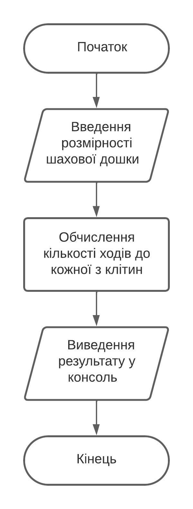
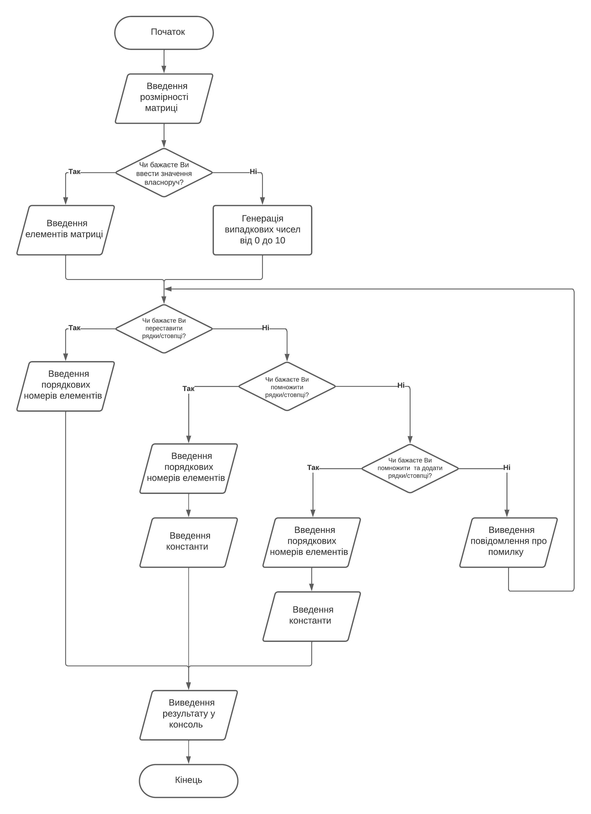
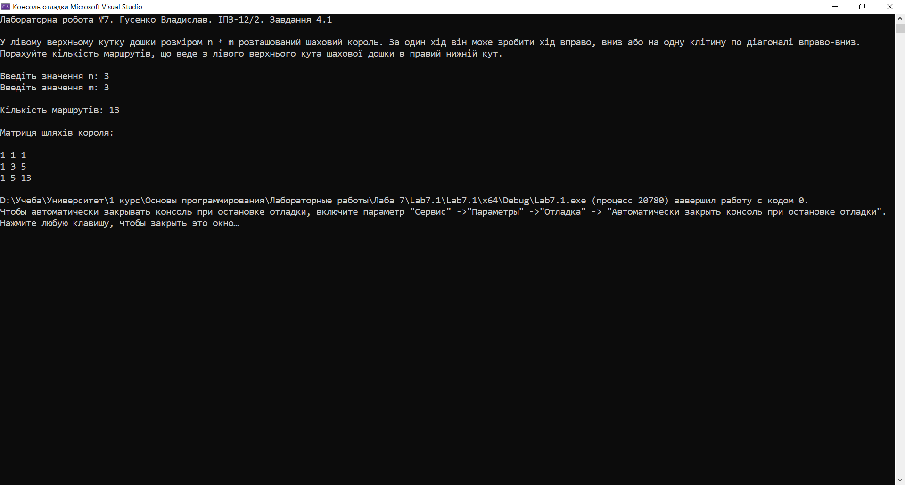
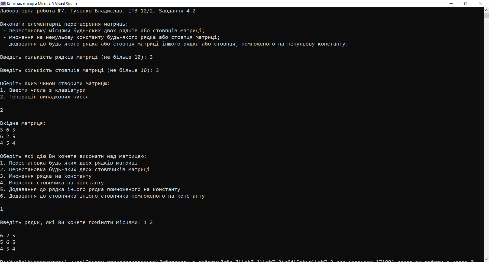
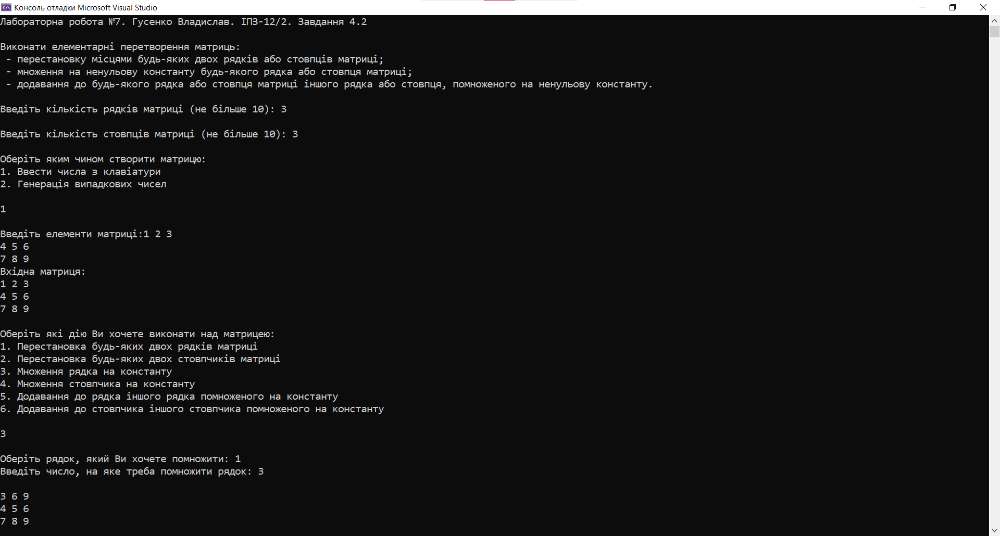

# Лабораторна робота №7

## Мета роботи

1. Ознайомитися з особливостями типу масиву;
2. Опанувати технологію застосування масивів даних;
3. Навчитися розробляти алгоритми та програми із застосуванням багатовимірних масивів

## Умова задачі

### Завдання 1

У лівому верхньому кутку дошки розміром n * m розташований шаховий король. За один хід він може зробити хід вправо, вниз або на одну клітину по діагоналі вправо-вниз. Порахуйте кількість маршрутів, що веде з лівого верхнього кута шахової дошки в правий нижній кут. Розміри дошки (числа n, m) ввести з клавіатури. На екран вивести кількість шуканих маршрутів, матрицю, в якій елементи, що є маршрутом шахового короля, позначені значенням 1, елементи матриці, які не входять до шуканих маршрутів, позначені значенням 0.

### Завдання 2 

Виконати елементарні перетворення матриць:
- перестановку місцями будь-яких двох рядків або стовпців матриці;
- множення на ненульову константу будь-якого рядка або стовпця матриці;
- додавання до будь-якого рядка або стовпця матриці іншого рядка або стовпця, помноженого на ненульову константу.
Для вибору способу створення матриці використовувати меню: введення значень елементів матриці з клавіатури або генерація псевдовипадкових чисел в заданому з клавіатури діапазоні значень. Індекси рядків та стовців матриці та число для множення рядка чи стовпця матриці для виконання елементарних перетворень задавати з клавіатури. Вивести на екран вхідну матрицю та усі її пертворення з відповідними повідомленнями.

## Аналіз задачі та теоретичні обґрунтування

### Завдання 1
Програма отримує від користувача розмірність дошки та генерує матрицю шляхів. Кожна клітинка матриці містить число - кількість способів дістатися до неї починаючи з верхнього лівого кута.

#### Основні етапи:
  - Введення розмірності шахової дошки;
  - Виведення матриці шляхів у консоль.

### Завдання 2
Програма створює матрицю, отримавши від користувача кількість рядків та стовпців. Користувач має вибір - згенерувати значення в масиві чи ввести їх власноруч. У консоль виводиться меню з видами операцій над матрицею - перестановка місцями будь-яких двох рядків або стовпців матриці, множення на ненульову константу будь-якого рядка або стовпця матриці, додавання до будь-якого рядка або стовпця матриці іншого рядка або стовпця, помноженого на ненульову константу. При виборі певної операції користувач вводить певні значення відповідно до власного вибору та отримує у консоль результат виконання.

#### Основні етапи:
  - Введення розмірності матриці
  - Вибір методу генерації елементів в масиві;
  - Вибір операції над матрицею
  - Виведення у консоль результату виконання;

## Алгоритм у вигляді блок-схеми

### Завдання 1 



### Завдання 2



## Код програми

**Код** всіх файлів наведений нижче:

### Завдання 1 :
```cpp
#include <iostream>
#include <Windows.h>

using namespace std;

const int MAX_SIZE = 10; // Максимальний розмір масиву

void introduction() // Вступна частина
{
    cout << "Лабораторна робота №7. Гусенко Владислав. ІПЗ-12/2. Завдання 4.1" << endl << endl;
    cout << "У лівому верхньому кутку дошки розміром n * m розташований шаховий король. За один хід він може зробити хід вправо, вниз або на одну клітину по діагоналі вправо-вниз." << endl;
    cout << "Порахуйте кількість маршрутів, що веде з лівого верхнього кута шахової дошки в правий нижній кут." << endl << endl;
}

// Функція для обчислення кількості маршрутів та виведення матриці
void countPaths(int n, int m) {
    int paths[MAX_SIZE][MAX_SIZE]; // Матриця для зберігання шляхів

    // Ініціалізуємо перший стовпчик та перший ряд матриці шляхів короля
    for (int i = 0; i < n; ++i)
        paths[i][0] = 1;
    for (int j = 0; j < m; ++j)
        paths[0][j] = 1;

    // Заповнюємо матрицю шляхів
    for (int i = 1; i < n; ++i) {
        for (int j = 1; j < m; ++j) {
            paths[i][j] = paths[i - 1][j] + paths[i][j - 1] + paths[i - 1][j - 1];
        }
    }

    // Виводимо кількість маршрутів
    cout << "Кількість маршрутів: " << paths[n - 1][m - 1] << endl << endl;

    // Виводимо матрицю з шляхом короля
    cout << "Матриця шляхів короля:" << endl << endl;
    for (int i = 0; i < n; ++i) {
        for (int j = 0; j < m; ++j) {
            cout << paths[i][j] << " ";
        }
        cout << endl;
    }
}

int main() 
{
    SetConsoleCP(1251);
    SetConsoleOutputCP(1251);

    introduction();

    int n, m;
    cout << "Введіть значення n: ";
    cin >> n;
    cout << "Введіть значення m: ";
    cin >> m;

    cout << endl;

    countPaths(n, m);

    return 0;
}
```

### Завдання 2 :
```cpp
#include <iostream>
#include <ctime>
#include <cstdlib>
#include <Windows.h>

using namespace std;

const int MAX_ROWS = 10; // Максимальна кількість рядків
const int MAX_COLS = 10; // Максимальна кількість стовпців

double matrix[MAX_ROWS][MAX_COLS]; // Матриця
int rows, cols; // Введена кількість рядків та стовпців
int choice; // Вибір операції
int row1, row2; // Рядки для перестановки
int col1, col2; // Стовпці для перестановки
int row; // Рядок для множення
int col; // Стовпець для множення
double constant; // Число, на яке множиться рядок або стовпець
int targetRow, sourceRow; // Цільовий рядок та рядок-джерело
int targetCol, sourceCol; // Цільовий стовпець та стовпець-джерело

// Вступна частина
void introduction()
{
    cout << "Лабораторна робота №7. Гусенко Владислав. ІПЗ-12/2. Завдання 4.2" << endl << endl;
    cout << "Виконати елементарні перетворення матриць:" << endl;
    cout << " - перестановку місцями будь-яких двох рядків або стовпців матриці;" << endl;
    cout << " - множення на ненульову константу будь-якого рядка або стовпця матриці;" << endl;
    cout << " - додавання до будь-якого рядка або стовпця матриці іншого рядка або стовпця, помноженого на ненульову константу." << endl << endl;
}

// Функція для створення масиву
void fillMatrix(double matrix[MAX_ROWS][MAX_COLS], int rows, int cols, bool generateRandom)
{
    if (generateRandom) {
        srand((unsigned)(time(NULL))); // Генератор випадкових чисел
        for (int i = 0; i < rows; ++i)
        {
            for (int j = 0; j < cols; j++)
            {
                matrix[i][j] = rand() % 10; // Випадкові числа
            }
        }
    }
    else
    {
        cout << "Введіть елементи матриці:";
        for (int i = 0; i < rows; ++i) 
        {
            for (int j = 0; j < cols; ++j) 
            {
                cin >> matrix[i][j];
            }
        }
    }
}

// Функція для виведення матриці на екран
void printMatrix(double matrix[MAX_ROWS][MAX_COLS], int rows, int cols)
{
    for (int i = 0; i < rows; ++i) 
    {
        for (int j = 0; j < cols; ++j) 
        {
            cout << matrix[i][j] << " ";
        }
        cout << endl;
    }
}

// Функція для перестановки двох рядків матриці
void swapRows(double matrix[MAX_ROWS][MAX_COLS], int row1, int row2, int cols)
{
    cout << "Введіть рядки, які Ви хочете поміняти місцями: ";
    cin >> row1 >> row2;

    for (int i = 0; i < cols; ++i)
    {
        double temp = matrix[row1 - 1][i];
        matrix[row1 - 1][i] = matrix[row2 - 1][i];
        matrix[row2 - 1][i] = temp;
    }

    cout << endl;

    printMatrix(matrix, rows, cols);
}

// Функція для перестановки двох стовпців матриці
void swapCols(double matrix[MAX_ROWS][MAX_COLS], int rows, int col1, int col2)
{
    cout << "Введіть стовпці, які Ви хочете поміняти місцями: ";
    cin >> col1 >> col2;

    for (int i = 0; i < rows; ++i)
    {
        double temp = matrix[i][col1 - 1];
        matrix[i][col1 - 1] = matrix[i][col2 - 1];
        matrix[i][col2 - 1] = temp;
    }

    cout << endl;

    printMatrix(matrix, rows, cols);
}

// Функція для множення рядка на константу
void multiplyRow(double matrix[MAX_ROWS][MAX_COLS], int row, int cols, double constant)
{
    cout << "Оберіть рядок, який Ви хочете помножити: ";
    cin >> row;
    cout << "Введіть число, на яке треба помножити рядок: ";
    cin >> constant;

    while (constant == 0)
    {
        cerr << "Помилка. Константа не може бути нулем. Спробуйте ще раз" << endl;
        cout << "Введіть число, на яке треба помножити стовпчик: ";
        cin >> constant;
    }

    for (int i = 0; i < cols; ++i)
    {
        matrix[row - 1][i] *= constant;
    }

    cout << endl;

    printMatrix(matrix, rows, cols);
}

// Функція для множення стовпчика на константу
void multiplyCol(double matrix[MAX_ROWS][MAX_COLS], int rows, int col, double constant)
{
    cout << "Оберіть стовпчик, який Ви хочете помножити: ";
    cin >> col;
    cout << "Введіть число, на яке треба помножити стовпчик: ";
    cin >> constant;

    while (constant == 0)
    {
        cerr << "Помилка. Константа не може бути нулем. Спробуйте ще раз" << endl;
        cout << "Введіть число, на яке треба помножити стовпчик: ";
        cin >> constant;
    }

    for (int i = 0; i < rows; ++i)
    {
        matrix[i][col - 1] *= constant;
    }

    cout << endl;

    printMatrix(matrix, rows, cols);
}

// Функція для додавання одного рядка, помноженого на константу, до іншого рядка
void addRow(double matrix[MAX_ROWS][MAX_COLS], int targetRow, int sourceRow, int cols, double constant)
{
    cout << "Введіть рядок, який хочете помножити: ";
    cin >> sourceRow;
    cout << "Введіть число, на яке треба помножити рядок: ";
    cin >> constant;

    while (constant == 0)
    {
        cerr << "Помилка. Константа не може бути нулем. Спробуйте ще раз" << endl;
        cout << "Введіть число, на яке треба помножити стовпчик: ";
        cin >> constant;
    }

    cout << "Введіть рядок, до якого хочете додати помножений рядок: ";
    cin >> targetRow;

    for (int i = 0; i < cols; ++i)
    {

        matrix[targetRow - 1][i] += matrix[sourceRow - 1][i] * constant;
    }

    cout << endl;

    printMatrix(matrix, rows, cols);
}

// Функція для додавання одного стовпчика, помноженого на константу, до іншого стовпчика
void addCol(double matrix[MAX_ROWS][MAX_COLS], int rows, int targetCol, int sourceCol, double constant)
{
    cout << "Введіть стовпчик, який хочете помножити: ";
    cin >> sourceCol;
    cout << "Введіть число, на яке треба помножити стовпчик: ";
    cin >> constant;

    while (constant == 0)
    {
        cerr << "Помилка. Константа не може бути нулем. Спробуйте ще раз" << endl;
        cout << "Введіть число, на яке треба помножити стовпчик: ";
        cin >> constant;
    }

    cout << "Введіть рядок, до якого хочете додати помножений стовпчик: ";
    cin >> targetCol;


    for (int i = 0; i < rows; ++i)
    {

        matrix[i][targetCol - 1] += matrix[i][sourceCol - 1] * constant;
    }

    cout << endl;

    printMatrix(matrix, rows, cols);
}

// Введення розмірності матриці
void size()
{
    cout << "Введіть кількість рядків матриці (не більше " << MAX_ROWS << "): ";
    cin >> rows;
    cout << endl;
    while (rows > MAX_ROWS)
    {
        cerr << "Помилка. Введена кількість рядків більша за вказане число. Спробуйте ще раз" << endl;
        cout << "Введіть кількість рядків матриці (не більше " << MAX_ROWS << "): ";
        cin >> rows;
        cout << endl;
    }
    cout << "Введіть кількість стовпців матриці (не більше " << MAX_COLS << "): ";
    cin >> cols;
    cout << endl;
    while (cols > MAX_COLS)
    {
        cerr << "Помилка. Введена кількість стовпців більша за вказане число. Спробуйте ще раз" << endl;
        cout << "Введіть кількість стовпців матриці (не більше " << MAX_COLS << "): ";
        cin >> cols;
        cout << endl;
    }
}

// Вибір варіанту створення матриці
void createMatrix()
{
    do
    {
        cout << "Оберіть яким чином створити матрицю:" << endl;
        cout << "1. Ввести числа з клавіатури" << endl;
        cout << "2. Генерація випадкових чисел" << endl;
        cout << endl;

        cin >> choice;
        cout << endl;

        switch (choice)
        {
        case 1: // Введення з клавіатури
            fillMatrix(matrix, rows, cols, false);
            break;
        case 2: // Випадкові числа
            fillMatrix(matrix, rows, cols, true);
            break;
        default:
            cout << "Неправильний вибір. Спробуйте ще раз" << endl << endl;
            break;
        }
    } while (choice < 1 || choice > 2);
}

// Виведення вхідної матриці
void outputMatrix()
{
    cout << "Вхідна матриця:" << endl;
    printMatrix(matrix, rows, cols);
    cout << endl;
}

// Меню завдання
void menu()
{
    do
    {
        cout << "Оберіть які дію Ви хочете виконати над матрицею:" << endl;
        cout << "1. Перестановка будь-яких двох рядків матриці" << endl;
        cout << "2. Перестановка будь-яких двох стовпчиків матриці" << endl;
        cout << "3. Множення рядка на константу" << endl;
        cout << "4. Множення стовпчика на константу" << endl;
        cout << "5. Додавання до рядка іншого рядка помноженого на константу" << endl;
        cout << "6. Додавання до стовпчика іншого стовпчика помноженого на константу" << endl << endl;

        cin >> choice;
        cout << endl;

        switch (choice)
        {
        case 1:
            swapRows(matrix, row1, row2, cols);
            break;
        case 2:
            swapCols(matrix, rows, col1, col2);
            break;
        case 3:
            multiplyRow(matrix, row, cols, constant);
            break;
        case 4:
            multiplyCol(matrix, rows, col, constant);
            break;
        case 5:
            addRow(matrix, targetRow, sourceRow, cols, constant);
            break;
        case 6:
            addCol(matrix, rows, targetCol, sourceCol, constant);
            break;
        default:
            cout << "Неправильний вибір. Спробуйте ще раз" << endl << endl;
            break;
        }
    } while (choice < 1 || choice > 6);
}

int main()
{
    SetConsoleCP(1251);
    SetConsoleOutputCP(1251);

    introduction();
    size();
    createMatrix();
    outputMatrix();
    menu();

    return 0;
}
```

## Результат виконання програми 

### Завдання 1



### Завдання 2 



## Аналіз достовірності результатів

### Завдання 1

Дивлячись на результат виконання програми, можна засвідчитися, що серед чисел `2, 7, 0, 8, 4` найменшим дійсно є число `0`, що у масиві розташовано за 2 індексом.


### Завдання 2
Дивлячись на результат виконання програми, можна засвідчитися, що серед чисел `9, 3, 6, 9, 3` має вийти результат `3, 3, 6, 9, 9`. При запиті знайти число 7 програма видасть помилку, а при запиті знайти число 6 програма видасть повідомлення про знаходження елемента за 2 індексом.



## Висновки 

Під час виконання лабораторної роботи №7 я опанував такі вміння:
- Ознайомився з особливостями типу масиву;
- Опанував технологію застосування масивів даних;
- Навчився розробляти алгоритми та програми із застосуванням багатовимірних масивів
