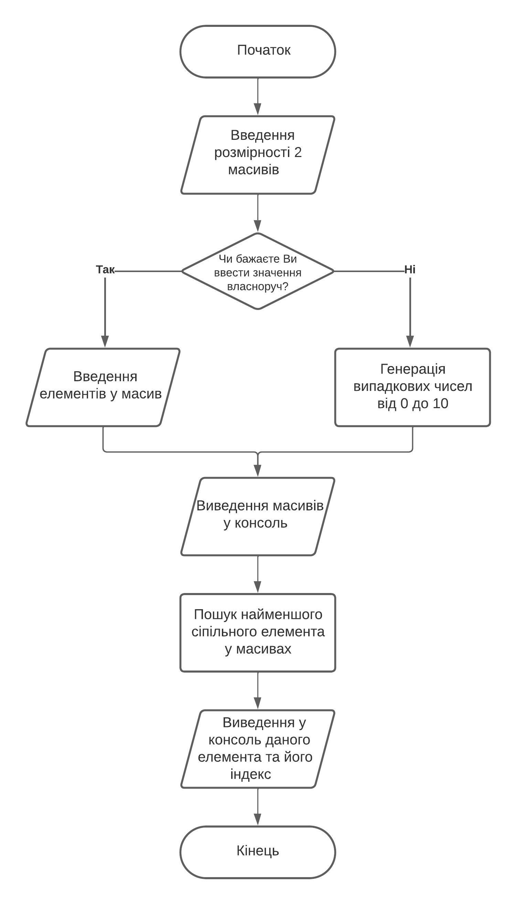
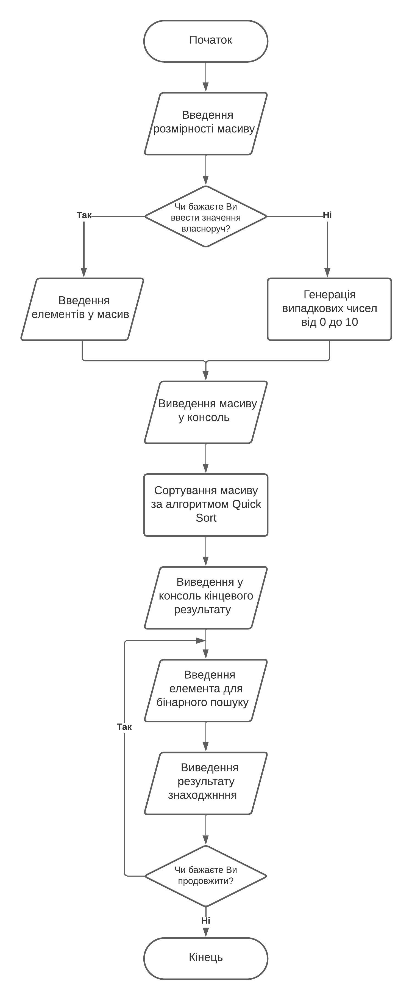
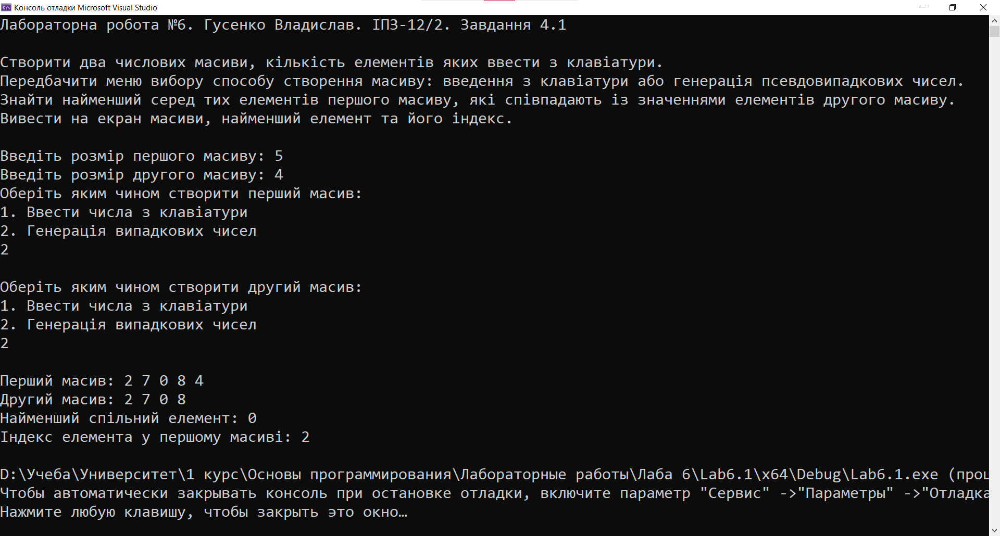
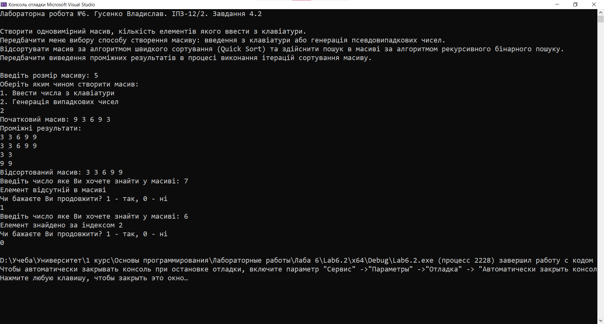

# Лабораторна робота №7

## Мета роботи

1. Ознайомитися з особливостями типу масиву;
2. Опанувати технологію застосування масивів даних;
3. Навчитися розробляти алгоритми та програми із застосуванням багатовимірних масивів

## Умова задачі

### Завдання 1

Створити два числових масиви, кількість елементів яких ввести з клавіатури. Передбачити меню вибору способу створення масиву: введення з клавіатури або генерація псевдовипадкових чисел. Знайти найменший серед тих елементів першого масиву, які співпадають із значеннями елементів другого масиву. Вивести на екран масиви, найменший елемент та його індекс.

### Завдання 2 

Створити одновимірний масив, кількість елементів якого ввести з клавіатури. Передбачити меню вибору способу створення масиву: введення з клавіатури або генерація псевдовипадкових чисел. Відсортувати масив за алгоритмом швидкого cортування (Quick Sort) та здійснити пошук в масиві за алгоритмом рекурсивного бінарного пошуку. Передбачити виведення проміжних результатів в процесі виконання ітерацій сортування масиву.

## Аналіз задачі та теоретичні обґрунтування

### Завдання 1
Програма створює два масиви даних, розмірність яких вводиться з клавіатури. Користувач має вибір - згенерувати значення в масиві чи ввести їх власноруч. У консоль виводяться масиви, а після цього у консоль виводиться найменше співпадіння в обох масивах та його індекс у першому масиві.

#### Основні етапи:
  - Введення розмірності масивів;
  - Вибір методу генерації елементів в масивах;
  - Виведення масивів у консоль
  - Визначення найменшого спільного елемента та його індекса у першому масиві;

### Завдання 2
Програма створює масив даних, розмірність якого вводиться з клавіатури. Користувач має вибір - згенерувати значення в масиві чи ввести їх власноруч. За допомогою алгоритма Quick Sort здійснюється сортування від найменшого до найбільшого елемента. Наостанок, користувач має можливість здійснити пошук елемента за допомогою бінарного пошуку - при знайденні елемента у консоль виводиться індекс цього елемента. Користувач може виконувати пошук до тих пір, поки сам цього хоче.

#### Основні етапи:
  - Введення розмірності масиву
  - Вибір методу генерації елементів в масиві;
  - Сортування масиву за допомогою алгоритма Quick Sort
  - Пошук елемента у масиві за допомогою бінарного пошуку;

## Алгоритм у вигляді блок-схеми

### Завдання 1 



### Завдання 2



## Код програми

**Код** всіх файлів наведений нижче:

### Завдання 1 :
```cpp
#include <iostream> 
#include <cstdlib>
#include <ctime>
#include <Windows.h>

using namespace std;

const int MAX_SIZE = 100; // Максимальний розмір масиву

void introduction()
{
    cout << "Лабораторна робота №6. Гусенко Владислав. ІПЗ-12/2. Завдання 4.1" << endl << endl;
    cout << "Створити два числових масиви, кількість елементів яких ввести з клавіатури." << endl;
    cout << "Передбачити меню вибору способу створення масиву: введення з клавіатури або генерація псевдовипадкових чисел." << endl;
    cout << "Знайти найменший серед тих елементів першого масиву, які співпадають із значеннями елементів другого масиву." << endl;
    cout << "Вивести на екран масиви, найменший елемент та його індекс." << endl << endl;
}

void createArray(int arr[], int size, bool generateRandom)  // Створення масиву
{
    if (generateRandom) {
        srand((unsigned)(time(NULL))); // Генератор випадкових чисел
        for (int i = 0; i < size; ++i) 
        {
            arr[i] = rand() % 10; // Випадкові числа
        }
    }
    else 
    {
        cout << "Введіть " << size << " чисел: ";
        for (int i = 0; i < size; ++i) 
        {
            cin >> arr[i]; // Числа, введені з клавіатури
        }
    }
}

void printArray(int arr[], int size) // Виведення масиву
{
    for (int i = 0; i < size; ++i) 
    {
        cout << arr[i] << " ";
    }
    cout << endl;
}

int findSmallestMatch(int arr1[], int size1, int arr2[], int size2, int& index) // Знайти найменше число, що належить обом масивам
{
    int smallestMatch = INT_MAX;
    index = -1; // Ініціалізуємо індекс найменшого співпадіння як -1 (якщо немає співпадіння)
    for (int i = 0; i < size1; ++i) 
    {
        for (int j = 0; j < size2; ++j) 
        {
            if (arr1[i] == arr2[j] && arr1[i] < smallestMatch) 
            {
                smallestMatch = arr1[i];
                index = i; // Оновлюємо індекс, коли знайдено менше співпадіння
            }
        }
    }
    return smallestMatch;
}

int main() 
{
    SetConsoleCP(1251);
    SetConsoleOutputCP(1251);

    introduction();

    //1 - параметр функції (винести в окрему функцію)

    int size1, size2;

    cout << "Введіть розмір першого масиву: ";
    cin >> size1;

    while (size1 > MAX_SIZE)
    {
        cout << "Введене число перевищує максимальний розмір матриці (100). Спробуйте ще раз" << endl;
        cout << "Введіть розмір першого масиву: ";
        cin >> size1;
    }
    // Не писати такий самий код, зміни через параметри
    cout << "Введіть розмір другого масиву: ";
    cin >> size2;

    while (size2 > MAX_SIZE)
    {
        cout << "Введене число перевищує максимальний розмір матриці (100). Спробуйте ще раз" << endl;
        cout << "Введіть розмір другого масиву: ";
        cin >> size2;
    }

    int arr1[MAX_SIZE];
    int arr2[MAX_SIZE];

    // 2 - окреме меню, функція

    cout << "Оберіть яким чином створити перший масив:" << endl;
    cout << "1. Ввести числа з клавіатури" << endl;
    cout << "2. Генерація випадкових чисел" << endl;
    int choice;
    cin >> choice;

    switch (choice) 
    {
    case 1:
        createArray(arr1, size1, false);
        cout << endl;
        break;
    case 2:
        createArray(arr1, size1, true);
        cout << endl;
        break;
    default:
        cout << "Вибір некоректний. За замовчуванням створюємо масив за допомогою введення чисел з клавіатури" << endl;
        createArray(arr1, size1, false);
        cout << endl;
        break;
    }
    // Меню - один раз, функція
    cout << "Оберіть яким чином створити другий масив:" << endl;
    cout << "1. Ввести числа з клавіатури" << endl;
    cout << "2. Генерація випадкових чисел" << endl;
    cin >> choice;

    switch (choice) 
    {
    case 1:
        createArray(arr2, size2, false);
        cout << endl;
        break;
    case 2:
        createArray(arr2, size2, true);
        cout << endl;
        break;
    default:
        cout << "Вибір некоректний. За замовчуванням створюємо масив за допомогою введення чисел з клавіатури" << endl;
        createArray(arr2, size2, false);
        cout << endl;
        break;
    }

    cout << "Перший масив: ";
    printArray(arr1, size1);
    cout << "Другий масив: ";
    printArray(arr2, size2);

    // 3 - окрема функція (найменший елемент)
    int smallestMatchIndex;
    int smallestMatch = findSmallestMatch(arr1, size1, arr2, size2, smallestMatchIndex);
    if (smallestMatch != INT_MAX) 
    {
        cout << "Найменший спільний елемент: " << smallestMatch << endl;
        cout << "Індекс елемента у першому масиві: " << smallestMatchIndex << endl;
    }
    else 
    {
        cout << "Спільні елементи відсутні" << endl;
    }

    return 0;
}
```

### Завдання 2 :
```cpp
#include <iostream>
#include <cstdlib>
#include <ctime>
#include <Windows.h>

using namespace std;

int vybir;

const int MAX_SIZE = 100; // Максимальний розмір масиву

void introduction()
{
    cout << "Лабораторна робота №6. Гусенко Владислав. ІПЗ-12/2. Завдання 4.2" << endl << endl;
    cout << "Створити одновимірний масив, кількість елементів якого ввести з клавіатури." << endl;
    cout << "Передбачити меню вибору способу створення масиву: введення з клавіатури або генерація псевдовипадкових чисел." << endl;
    cout << "Відсортувати масив за алгоритмом швидкого cортування (Quick Sort) та здійснити пошук в масиві за алгоритмом рекурсивного бінарного пошуку." << endl;
    cout << "Передбачити виведення проміжних результатів в процесі виконання ітерацій сортування масиву." << endl << endl;
}

void fillArray(int arr[], int size, bool generateRandom)  // Створення масиву
{
    if (generateRandom) {
        srand((unsigned)(time(NULL))); // Генератор випадкових чисел
        for (int i = 0; i < size; ++i)
        {
            arr[i] = rand() % 10; // Випадкові числа
        }
    }
    else
    {
        cout << "Введіть " << size << " чисел: ";
        for (int i = 0; i < size; ++i)
        {
            cin >> arr[i]; // Числа, введені з клавіатури
        }
    }
}

void printArray(int arr[], int size) // Виведення масиву
{
    for (int i = 0; i < size; ++i)
    {
        cout << arr[i] << " ";
    }
    cout << endl;
}


void quickSort(int arr[], int left, int right) // Швидке сортування
{
    int i = left, j = right;
    int pivot = arr[(left + right) / 2];

    // Розбиття масиву навколо опорного елементу
    while (i <= j) 
    {
        while (arr[i] < pivot) 
        {
            i++;
        }
        while (arr[j] > pivot) 
        {
            j--;
        }
        if (i <= j) 
        {
            swap(arr[i], arr[j]);
            i++;
            j--;
        }
        printArray(arr + left, right - left + 1);
    }

    // Рекурсивний виклик для лівої та правої частин після розбиття
    if (left < j) 
    {
        quickSort(arr, left, j);
    }
    if (i < right) 
    {
        quickSort(arr, i, right);
    } 
}

int binarySearch(int arr[], int left, int right, int key) 
{
    while(left <= right)
    {
        int mid = left + (right - left) / 2;

        // Якщо елемент знайдено в середині
        if (arr[mid] == key) 
        {
            return mid;
        }

        // Шукаємо в правій або лівій частині
        if (arr[mid] < key) 
        {
            left = mid + 1;
        }
        else {
            right = mid - 1;
        }
    }

    // Якщо елемент не знайдено в масиві
    return -1;
}

int main()
{
    SetConsoleCP(1251);
    SetConsoleOutputCP(1251);

    introduction();

    int size;
    cout << "Введіть розмір масиву: ";
    cin >> size;

    while (size > MAX_SIZE)
    {
        cout << "Введене число перевищує максимальний розмір матриці (100). Спробуйте ще раз" << endl;
        cout << "Введіть розмір масиву: ";
        cin >> size;
    }

    int arr[MAX_SIZE];

    cout << "Оберіть яким чином створити масив:" << endl;
    cout << "1. Ввести числа з клавіатури" << endl;
    cout << "2. Генерація випадкових чисел" << endl;
    int choice;
    cin >> choice;

    switch (choice)
    {
    case 1:
        fillArray(arr, size, false);
        break;
    case 2:
        fillArray(arr, size, true);
        break;
    default:
        cout << "Вибір некоректний. За замовчуванням створюємо масив за допомогою введення чисел з клавіатури" << endl;
        fillArray(arr, size, false);
        break;
    }

    cout << "Початковий масив: ";
    printArray(arr, size);

    cout << "Проміжні результати: " << endl;
    quickSort(arr, 0, size - 1);

    cout << "Відсортований масив: ";
    printArray(arr, size);

    do
    {
        int key;
        cout << "Введіть число яке Ви хочете знайти у масиві: ";
        cin >> key;

        int result = binarySearch(arr, 0, size - 1, key);
        if (result != -1)
        {
            cout << "Елемент знайдено за індексом " << result << endl;
        }
        else
        {
            cout << "Елемент відсутній в масиві" << endl;
        }

        cout << "Чи бажаєте Ви продовжити? 1 - так, 0 - ні" << endl;
        cin >> vybir;

    } while (vybir != 0);

    return 0;                                                                                                                                                                             
}
```

## Результат виконання програми 

### Завдання 1



### Завдання 2 



## Аналіз достовірності результатів

### Завдання 1

Дивлячись на результат виконання програми, можна засвідчитися, що серед чисел `2, 7, 0, 8, 4` найменшим дійсно є число `0`, що у масиві розташовано за 2 індексом.


### Завдання 2
Дивлячись на результат виконання програми, можна засвідчитися, що серед чисел `9, 3, 6, 9, 3` має вийти результат `3, 3, 6, 9, 9`. При запиті знайти число 7 програма видасть помилку, а при запиті знайти число 6 програма видасть повідомлення про знаходження елемента за 2 індексом.


## Висновки 

Під час виконання лабораторної роботи №6 я опанував такі вміння:
- Ознайомився з особливостями типу масиву;
- Опанував технологію застосування масивів даних;
- Навчився розробляти алгоритми та програми із застосуванням багатовимірних масивів
