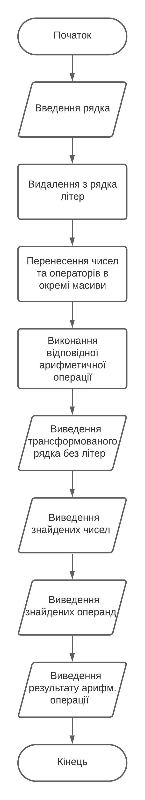
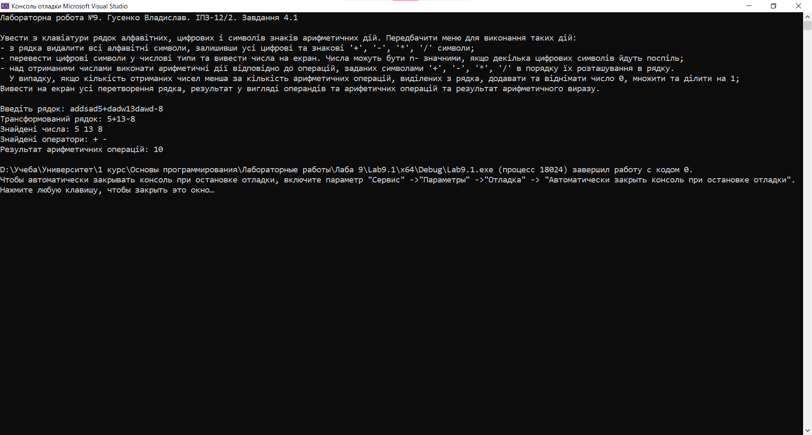

# Лабораторна робота №9

## Мета роботи

1. Опанувати навички використання рядків
2. Вивчити основні операції над рядками
3. Навчитися використовувати рядки для розробки програм

## Умова задачі

Увести з клавіатури рядок алфавітних, цифрових і символів знаків арифметичних дій. Передбачити меню для виконання таких дій:
- з рядка видалити всі алфавітні символи, залишивши усі цифрові та знакові '+', '-', '*', '/' символи;
- перевести цифрові символи у числові типи та вивести числа на екран. Числа можуть бути n- значними, якщо декілька цифрових символів йдуть поспіль;
- над отриманими числами виконати арифметичні дії відповідно до операцій, заданих символами '+', '-', '*', '/' в порядку їх розташування в рядку. У випадку, якщо кількість отриманих чисел менша за кількість арифметичних операцій, виділених з рядка, додавати та віднімати число 0, множити та ділити на 1;
Вивести на екран усі перетворення рядка, результат у вигляді операндів та арифетичних операцій та результат арифметичного виразу.

## Аналіз задачі та теоретичні обґрунтування

Програма отримує від користувача рядок з символами. У цьому рядку за допомогою функції `!isalpha()` знаходимо усі елементи, що не є буквеними та залишаємо їх у рядку. Наступним кроком є створення масивів для чисел та операнд, куди за аналогічним методом пошуку ми виносимо знайдені символи. Після цього ми виконуємо арифметичні операції та виводимо результат у консоль.

#### Основні етапи:

  - Отримання від користувача рядка
  - Видалення літер з рядка
  - Винесення чисел та операнд в окремі масиви
  - Виконання арифметичних операцій
  - Виведенн результату у консоль

## Алгоритм у вигляді блок-схеми



## Код програми

```cpp
#include <iostream>
#include <ctype.h>
#include <stdlib.h>
#include <string.h>
#include <Windows.h>

using namespace std;

const int maxLength = 100; // Максимальна довжина вводу
char input[maxLength]; // Введений рядок

void introduction() // Вступна частина
{
    cout << "Лабораторна робота №9. Гусенко Владислав. ІПЗ-12/2. Завдання 4.1" << endl << endl;
    cout << "Увести з клавіатури рядок алфавітних, цифрових і символів знаків арифметичних дій. Передбачити меню для виконання таких дій:" << endl;
    cout << "- з рядка видалити всі алфавітні символи, залишивши усі цифрові та знакові '+', '-', '*', '/' символи;" << endl;
    cout << "- перевести цифрові символи у числові типи та вивести числа на екран. Числа можуть бути n- значними, якщо декілька цифрових символів йдуть поспіль;" << endl;
    cout << "- над отриманими числами виконати арифметичні дії відповідно до операцій, заданих символами '+', '-', '*', '/' в порядку їх розташування в рядку. " << endl;
    cout << "  У випадку, якщо кількість отриманих чисел менша за кількість арифметичних операцій, виділених з рядка, додавати та віднімати число 0, множити та ділити на 1; " << endl;
    cout << "Вивести на екран усі перетворення рядка, результат у вигляді операндів та арифетичних операцій та результат арифметичного виразу." << endl << endl;
}

void removeLetters(char* str) // Видалення літер з рядка
{
    int len = strlen(str); // Довжина рядка
    int index = 0; // Індекс для запису цифр та арифм. символів

    for (int i = 0; i < len; ++i) 
    {
        if (!isalpha(str[i])) 
        {
            str[index++] = str[i]; // Якщо символ не є літерою, то переписуємо його на позицію index
        }
    }

    str[index] = '\0'; // Кінець рядка
}

void performOperations(char* str) // Виконання арифм. операцій
{
    int len = strlen(str); // Довжина рядка
    int numbers[50]; // Масив чисел
    char operators[50]; // Масив операторів
    int numIndex = 0, opIndex = 0; // Індекс номера та індекс оператора
    char currentNumber[20]; // Поточне число
    int numLen = 0; // Довжина числа

    for (int i = 0; i <= len; ++i) 
    {
        if (isdigit(str[i])) 
        {
            currentNumber[numLen++] = str[i]; // Якщо елемент є цифрою, то додаємо його до масиву поточного числа
        }
        else if (str[i] == '+' || str[i] == '-' || str[i] == '*' || str[i] == '/' || str[i] == '\0') 
        {
            currentNumber[numLen] = '\0'; // Якщо елемент є оператором або кінцем рядка, то закінчуємо рядок поточного числа...
            numLen = 0; // Обнуляємо довжину числа...
            numbers[numIndex++] = atoi(currentNumber); // Переводимо поточне число у ціле та записуємо його у масив чисел

            if (str[i] != '\0') 
            {
                operators[opIndex++] = str[i]; // Якщо елемент є оператором, то записуємо його у масив операторів
            }
        }
    }

    // 4. Виконання множення та ділення спочатку
    int tempNumbers[maxLength]; // Тимчасовий масив для зберігання чисел після множення/ділення
    char tempOperations[maxLength]; // Тимчасовий масив для зберігання операцій після множення/ділення
    int tempNumbersIndex = 0;
    int tempOperationsIndex = 0;
    int tempResult = numbers[0];

    int result = numbers[0]; // Результат - перше число в масиві чисел

    for (int i = 0; i < opIndex; ++i) 
    {
        switch (operators[i]) // Виконуємо операцію згідно оператора
        {
        case '+':
            result += numbers[i + 1];
            break;
        case '-':
            result -= numbers[i + 1];
            break;
        case '*':
            result *= numbers[i + 1];
            break;
        case '/':
            if (numbers[i + 1] != 0) {
                result /= numbers[i + 1];
            }
            else {
                cerr << "Помилка, ділення на 0!"; // Виводимо повідомлення про помилку при діленні на 0
                return;
            }
            break;
        }
    }

    cout << "Трансформований рядок: " << str << endl;
    cout << "Знайдені числа: ";
    for (int i = 0; i < numIndex; ++i) 
    {
        cout << numbers[i] << " ";
    }
    cout << endl;
    cout << "Знайдені оператори: ";
    for (int i = 0; i < opIndex; ++i) 
    {
        cout << operators[i] << " ";
    }
    cout << endl;
    cout << "Результат арифметичних операцій: " << result << endl;
}

int main() 
{
    SetConsoleCP(1251);
    SetConsoleOutputCP(1251);

    introduction();

    cout << "Введіть рядок: ";
    cin.get(input, maxLength);

    removeLetters(input);
    performOperations(input);

    return 0;
}
```

## Результат виконання програми 



## Аналіз достовірності результатів

Вводимо рядок, що містить літери, цифри 5, 13, 8` та операнди `+, -`. Якщо прибрати всі літери, то залишиться вираз `5+13-8`, результатом якого є `10`. Як можна засвідчитися, програма правильно визначає числа, операнди та видає коректний результат.


## Висновки 

Під час виконання лабораторної роботи №9 я опанував такі вміння:
- Опанував навички використання рядків
- Вивчив основні операції над рядками
- Навчився використовувати рядки для розробки програм
